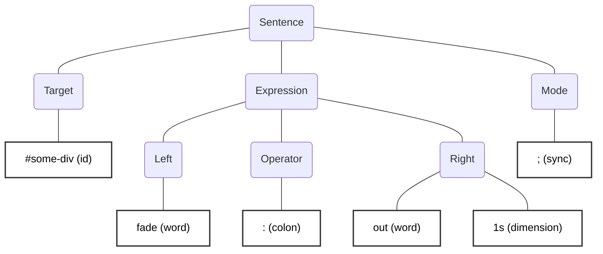

# act

> 
> [](LICENSE)

```html
<script src="act.js"></script>
<button act@click="alert: `Just act, don't react!`">Click me!</button>
```

**act** is a scripting language for HTML.

<details>
<summary>Table of Contents</summary>

- [What?](#what)
- [Why?](#why)
- [Getting Started](#getting-started)
    - [Installation](#installation)
    - [In a nutshell](#in-a-nutshell)
- [Core Concepts](#core-concepts)
    - [Events](#events)
    - [Language](#language)
    - [Values](#values)
    - [Data Scopes](#data-scopes)
    - [act Blocks](#act-blocks)
    - [Sentences](#sentences)
- [Language Reference](#language-reference)
    - [Expressions](#expressions)
    - [Operators](#operators)
    - [Prefixes](#prefixes)
    - [Keywords](#keywords)
    - [Signals](#signals)
- [Act Library](#act-library)
    - [Element Methods](#element-methods)
    - [Object/Collection Methods](#objectcollection-methods)
    - [Array Methods](#array-methods)
    - [String Methods](#string-methods)
    - [Global Methods](#global-methods)
    - [Window Functions](#window-functions)
    - [Reserved Words](#reserved-words)
- [Events Reference](#events-reference)
    - [Event Binding](#event-binding)
    - [Multiple Events](#multiple-events)
    - [IntersectionObserver Events](#intersectionobserver-events)
    - [The `act` Event](#the-act-event)
    - [Event Modifiers](#event-modifiers)
    - [Key Modifiers](#key-modifiers)
    - [Event Aliases](#event-aliases)
    - [Custom Events](#custom-events)
- [Advanced](#advanced)
    - [Configuration](#configuration)
    - [Extending the library methods](#extending-the-library-methods)
    - [Lazy evaluation](#lazy-evaluation)
    - [Extending keyword operations](#extending-keyword-operations)
    - [Results and Solving](#results-and-solving)
    - [htmx Integration](#htmx-integration-act-htmxjs)
- [Testing](#testing)
    - [Running Tests](#running-tests)
    - [Test Coverage](#test-coverage)
    - [Test Interface](#test-interface)
- [TypeScript Support](#typescript-support)
- [Editor Support](#editor-support)
- [Security](#security)
- [Contributing](#contributing)

</details>

## What?

- ⤵️ Add it to your HTML with just a `script` tag: no compilation, no dependencies, no build process, no shenanigans

- 📍 act code is put right into HTML elements using attributes or script tags, embracing **[locality of behaviour](https://htmx.org/essays/locality-of-behaviour/)**

- 🎯 All the code is parsed when the DOM is ready and then executed on standard DOM events

- 🎉 Supports literal `{query selectors}`, `#ids`, `.classes`, `<tags>`, `@attributes`, `*css-properties` and dimensions (`12px`, `1.2rem`, `400ms`, `100%`, ...)

- ⏳ Handles synchronous and asynchronous code with ease

- 🤝 JavaScript classes and functions are available within act code

- ⭕️ Aims to have a compact syntax

- 🧩 Easily extensible through a simple JavaScript API

- 🙋 act focuses in ease of use, not performance

- 🧑‍💻 Syntax highlighting for VSCode, TextMate, Visual Studio and JetBrains IDEs

- 🫡 Inspired by great libraries like [**_hyperscript**](https://hyperscript.org/), [**surreal**](https://github.com/gnat/surreal) and [**intercooler.js** `ic-action`](https://intercoolerjs.org/attributes/ic-action).

- 🐴 Simple integration with [**htmx**](https://htmx.org/) using the `act-htmx.js` htmx extension

- 🫨 It's unstable and highly experimental

## Why?

**JavaScript**, oh JavaScript... Love it or hate it, it's right there.\
As it gets more features, I feel that it has lost some focus.\
One of JavaScript's basic use cases, DOM manipulation, still feels cumbersome and verbose.\
**act** aims to address this by providing a more concise and expressive way to manage DOM interactions that is right there, in the elements themselves.

Let's look at this simple example:

```html
<button id="hide-btn">When I'm clicked I will hide after 1 second.</button>
...
<script>
    document.addEventListener('DOMContentLoaded', () => {
        document.getElementById('hide-btn').addEventListener('click', (e) => {
            setTimeout(() => {
                e.target.style.display = 'none';
            }, 1000);
        });
    });
</script>
```

Now we are used to it, we've seen or even write code like this for years. But... when you think about it, it's a lot of code and it's not like we want to do some very complex stuff: just hide the button after 1 second.

You could write that with an `onclick` attribute, but that is [frowned upon](https://developer.mozilla.org/en-US/docs/Web/HTML/Reference/Attributes#event_handler_attributes):

```html
<button onclick="setTimeout(() => { this.style.display = 'none'; }, 1000);">When I'm clicked I will hide after 1 second.</button>
```

It's like JavaScript is begging to be abstracted away.

```html
<button id="hide-btn">When I'm clicked I will hide after 1 second.</button>
...
<!-- A lot of HTML later... -->
<script>
    $(document).ready(function() {
        $('#hide-btn').click(function(e) {
            setTimeout(function() {
                $('#hide-btn').hide();
            }, 1000);
        });
    });
</script>
```

Well... yeah... We've been there before. A little bit of this is fine I guess, but as the code grows (and it doesn't need to grow that much) it gets hard to manage and maintain.

```bash
npx create-react-app my-app
```

Wait, wait... Maybe that's too much.

Could there be another way?

> grug much prefer put code on the thing that do the thing. now when grug look at the thing grug know the thing what the thing do, alwasy good relief!
>
> -[_The Grug Brained Developer_](https://grugbrain.dev/#grug-on-soc)

With act the behavior is expressed in this compact way within the button itself:

```html
<button act@click="wait: 1s; hide!;">When I'm clicked I will hide after 1 second.</button>
```

## Getting Started

### Installation

Simply include the `act.js` file in your HTML. No build steps required. You can vendor it or use a CDN.

```html
<script src="act.js"></script>
```

### In a nutshell

```html
<button 
    act="fade: out 500ms; fade: in 500ms; repeat;"
    act@click="kill act"
>
    I will stop fading in and out when you click me!
</button>


<div id="one" style="width: 100px; height: 100px; background-color: red;">
    <script type="text/act">
        transition: color to blue in 1s; 
        transition: color to red in 1s;
        repeat;
    </script>
</div>
<div id="two" style="width: 100px; height: 100px; background-color: green;">
    <script type="text/act">
        transition: color to yellow in 1s; 
        transition: color to green in 1s; 
        repeat;
    </script>
</div>
<button act@click="#one toggle!; #two toggle!">Toggle divs</button>
<button act@click="#one kill act; #two kill act">Stop animations</button>


<h1>AI Dinner suggester 2000</h1>
<ul id="dinner-list" act@click:target="confirm: `Remove {:inner_text}?` ? collapse!">
    <li>Pizza</li>
    <li>Pasta</li>
    <li>Salad</li>
    <li>Sushi</li>
    <li>Steak</li>
</ul>
<button class="button">
    <script type="text/act" act@click>
    with new <li>, do
        $name: prompt: 'Name of the dinner item:';
        not $name? stop;
        << $name;
        #dinner-list append: me;
    end;
    </script>
    Add a new dinner item
</button>
<button class="button"> 
    <script type="text/act" act@click>
        $items: {#dinner-list li};
        $decided: random: 0 ($items.length - 1);
        alert: `Today I suggest {$items[$decided].inner_text} for dinner!`;
    </script>
    Decide dinner!
</button>
```

> [!NOTE]
> Remember to follow a healthy diet, exercise regularly, and drink plenty of water.

## Core Concepts

### Events

Act code runs in response to events. You attach code to elements using the `act@eventname` attribute:

```html
<button act@click="fade: out">Click to fade out</button>
```

Or use `<script type="text/act" act@eventname>` tags for longer code:

```html
<button>
    <script type="text/act" act@click>
        fade: out;
        wait: 1s;
        fade: in;
    </script>
    Click me
</button>
```

Common events: `click`, `input`, `submit`, `mouseover`, etc. You can also use custom events.

The special `act` event runs when the page loads (on `DOMContentLoaded`).

→ [See detailed Events documentation](#events-reference) for modifiers, aliases, and custom events.

### Language

Act code is composed of **Scopes**, containing a list of **Sentences**. These sentences have **Expressions** that use **Values**.

#### Syntax Fundamentals

**Sentences** → [See Sentences](#sentences)

Act code is written in sentences. Each sentence typically performs one action:

```act
#my-element hide!;
```

Sentences end with a terminator (`;` by default). Multiple sentences are written one after another:

```act
#box1 hide!;
wait: 1s;
#box2 show!;
#box3 fade: in 1s&   // & terminator is used to run the sentence asynchronously
#box4 fade: out 1s;
```

**Target and Operation** → [See Sentence target](#sentence-target)

Most sentences follow this pattern: `target operation arguments`

- **Target**: What you want to act on (element, variable, etc.). If not specified, it defaults to the element where the act code is located.
- **Operation**: What you want to do (method, keyword, operator)
- **Arguments**: Data needed for the operation

```act
#my-element hide!;              // Target: #my-element, Operation: call hide
$name: 'John';                  // Operation: assignment
alert: 'Hello!';                // Operation: call alert
```

**Calling Methods** → [See Call](#call)

Methods are called with `!` and can take arguments using `!:`:

```act
#element hide!;                  // No arguments
#element fade!: out 500ms;       // With arguments
$array push!: 'item';            // Method on a variable
```

**Accessing Properties** → [See Values](#values)

Properties use prefixes to indicate what type of property you're accessing:

```act
#input :value;                  // DOM property (:)
#element *background-color;     // CSS property (*)
#element @disabled;             // HTML attribute (@)
```

The **colon operator** (`:`) is the **Act operation** - it automatically infers whether to **set** or **call** based on the **type** of value on the left:

```act
// Set (when left is a property, attribute, CSS property, or variable)
#input :value: 'text';           // Property: sets value
#input value: 'text';            // Word that resolves to a property: sets value
#element *background: red;       // CSS property: sets background
#button @disabled: true;         // Attribute: sets disabled
$name: 'John';                   // Variable: sets variable

// Call (when left is a word/method name)
fade: in 500ms;                  // Word: calls fade method
alert: 'Hello!';                 // Word: calls alert function
```

**Explicit set** → [See Set](#set)

You can use the `=` operator to explicitly set a value, without inferring the operation:

```act
#input :value = 'text';           // Property: sets value
#input value = 'text';            // Word that resolves to a property: sets value
#element *background = red;       // CSS property: sets background
#button @disabled = true;         // Attribute: sets disabled
$name = 'John';                   // Variable: sets variable
```

**Working with Variables** → [See Data Scopes](#data-scopes)

Variables start with `$`:

```act
$text: 'Hello';
```

Variables starting with a capital letter are **global**:

```act
$Global_var: 'accessible everywhere';
$scoped_var: 'only in this scope';
```

You can also use the `global`, `local` and `scoped` prefixes to specify explicitly the variable scope:

```act
global $global_var: 'accessible everywhere';
local $local_var: 'only in this element';
scoped $scoped_var: 'only in this scope';
```

**Selecting Elements** → [See Values](#values)

Elements can be selected using familiar CSS-like syntax:

```act
#my-id                          // ID selector
.my-class                       // Class selector (returns collection)
<div>                           // Tag selector (returns collection)
{div > .item}                   // Selector template (query)
```

**Keywords** → [See Keywords](#keywords)

Use `if`, `each`, `while`, and other keywords for logic:

```act
each $item in $list (
    log: $item;
);

if $name is 'John' (
    alert: 'Hello John!';
);
```

**Scopes** → [See Sentences](#sentences)

Group multiple sentences using parentheses `()` or `do...end`.
Scopes allow to create scoped variables, only accessible in the current scope and its children.

```act
(
    wait: 1s;
    show!;
);

do
    $x: 10;
    log: $x;
    (
        log: `I will print 10: {$x}`;
    );
end;

do
    log: $x;  // It will not print 10 as this is a different scope and $x is not defined.
end;
```

**Operators** → [See Operators](#operators)

Common operators work as expected:

```act
$sum: 1 + 2;
$product: 3 * 4;
$is_equal: $a is $b;
$is_greater: $x > 5;
```

**String Templates** → [See Values](#values)

Use backticks for string interpolation:

```act
$name: 'World';
log: `Hello, {$name}!`;         // Interpolate variables
log: `Sum: {1 + 2}`;            // Interpolate expressions
```

### Values

| Type | Description | Example |
| --- | --- | --- |
| **String** | Text wrapped in single or double quotes. Supports escape characters like `\n` or `\t`. | `"Hello\nworld!"`, `'Hello\nworld!'` |
| **Word** | An unquoted string containing only alphanumeric characters, underscores, and dashes. Some words are [reserved](#reserved-words). | `aliceblue`, `red`, `hello-world` |
| **Number** | Integers or decimal numbers. | `123`, `1.23`, `-12.3` |
| **Boolean** | True or false values. | `true`, `false` |
| **Variable** | A word prefixed by `$`. Used to store and retrieve values. | `$some_variable`, `$someVariable` |
| **CSS Property** | A CSS property of the target element. Prefixed by `*`. | `*background-color`, `*opacity` |
| **Dimension** | A number with a unit (px, rem, em, s, ms, %, etc.). | `123px`, `1.23rem`, `3s`, `50%` |
| **Attribute** | An HTML element attribute. Prefixed by `@`. | `@disabled`, `@data-value` |
| **Property** | A property of the [target](#sentence-target). Prefixed by `:`. | `:innerText`, `:value` |
| **Null** | Represents no value. | `null` |
|| **DOM REFERENCES** ||
| **Id** | An HTML element ID. Prefixed by `#`. Returns the element with that ID. | `#some-id`, `#header` |
| **Class** | An HTML element class. Prefixed by `.`. Returns all elements with that class. | `.some-class`, `.button` |
| **Tag** | An HTML tag. Wrapped in `<>`. Returns all elements with that tag. | `<div>`, `<button>` |
|| **COLLECTIONS** ||
| **Array** | A list of values separated by spaces or commas, wrapped in `[]`. | `[1 2 3]`, `["a", "b", "c"]` |
| **Object** | Key-value pairs separated by colons, wrapped in `[]`. Keys and values can be separated by spaces or commas. Use `[:]` as an empty object. | `[key1: value1 key2: value2]`, `[name: 'John', age: 30]` |
|| **TEMPLATES** ||
| **String Template** | A string with interpolations wrapped in backticks. Interpolations use `{}` and can contain full sentences. | `` `Hello {$name}!` ``, `` `Result: {2 + 3}` `` |
| **Selector Template** | A CSS query selector wrapped in `{}`. Returns matching elements. Supports interpolations and [prefixes](#selector-template-prefixes). | `{#some-div}`, `{p > .class}`, `{#{$id}}` |
|| **EVALUABLES** ||
| **Scope** | A collection of sentences wrapped in `()` or `do ... end`. Can hold values, expressions, or multiple sentences. | `(2 + 3)`, `do wait: 1s; log: 'Done' end` |
| **Function** | An anonymous function defined with `->`. Can have arguments. Returns the value of the last sentence or using `return`. | `->( log: 'Hi' )`, `-> $x $y ($x + $y)` |
|| **COMMENTS** | Yes, comments are not values but I didn't know where to put them |
| **Single line comments** | Single line comments start with `//` and continue until the end of the line. | `// This is a single line comment` |
| **Multi line comments** | Multi line comments start with `/*` and end with `*/`. They can span multiple lines. | `/* This is a multi line comment`<br />`That spans multiple lines */` |
|| **VALUES WE WISH DIDN'T EXIST** ||
| **undefined** | 🤷 | `undefined` |
| **Not a number** | `'a' * 1` | `NaN` |

> [!NOTE]
> **Automatic Case Conversion & JavaScript Method Access**
> 
> When accessing properties or calling methods, act automatically converts **snake_case** to **camelCase**.
> This means you can write `:inner_text` to access `innerText`, or `query_selector_all` to call `querySelectorAll`.
> 
> **You can call any native JavaScript method** on values using this conversion. For example:
> - `$number.to_string: 16` calls the native `toString(16)` method
> - `#my-element focus!` calls the native `focus()` method
> - `$string.to_upper_case!` calls the native `toUpperCase()` method
> 
> This makes act seamlessly integrate with the entire JavaScript API using the **superior** snake_case.

#### Selector Template Prefixes

Selector templates are not just a convenient way to call `document.querySelectorAll` under the hood, they have **prefixes** that alter the query behavior.

| Prefix | Description | Example |
| --- | --- | --- |
| `< ...` | Returns the [closest](https://developer.mozilla.org/en-US/docs/Web/API/Element/closest) element that matches the CSS query | `{< div.button}`, `{< p}` |
| `> ...` | Returns the elements that match the CSS query inside the current element. Can be used with selectors. | `{> p > span.highlighted}`, `{> a}` |

### Data Scopes

Variables in act have three possible scopes: **global**, **local (element)**, and **scoped**.

#### Global Scope

Variables in the global scope are variables that can be accessed from all places within the page.
They are declared with the `$` prefix and an **initial capital letter**.
You can also access and declare global variables using the `global` prefix.

```html
<div id="user-profile">
    <input type="text" name="user-name" act@input="$Name: :value">
    <!-- ... -->
</div>
<!-- ... -->
<!-- Somewhere else on the page -->
<div id="some-other-div">
    <button id="some-other-action">
        <script type="text/act" act@click>
            not $Name?
                alert: 'Please complete your profile first!'
            else? do
                $Name is 'John'? 
                    alert: 'Sorry but John is not allowed to do that.'
                else? 
                    alert: 'OK!';
            end;
        </script>
        Do some stuff!
    </button>
</div>
```

> [!NOTE]
> Global variables are stored in the `body` element. The variable lookup code goes directly to the `body` element when the variable name starts with a capital letter or the `global` prefix is used.

#### Local (Element) Scope

Variables in the local scope are variables that can be accessed only within the element where they are declared and its children.

They are declared using the `local` prefix, and the name of the variable cannot start with a capital letter.

```html
<div id="some-div" act="local $some_var: 1; $another_var: 1;"><!-- Both variables are 1 -->
    <button id="some-button" act@click="alert: `$some_var is {$some_var}, and $another_var is {$another_var}`">
        Click me!
    </button>
</div>

<div act="local $foo: 1">
    <!-- Here $foo is 1, $bar is undefined, $baz is undefined -->
    <div act="local $bar: 2">
        <!-- Here $foo is 1, $bar is 2, $baz is undefined -->
        <div act="local $baz: 3">
            <!-- Here $foo is 1, $bar is 2, $baz is 3 -->
        </div>
    </div>
</div>
```

#### Scoped Variables

Scoped variables are variables that can be accessed only within the Scope where they are declared and its nested scopes.

They are declared using the `scoped` prefix, and the name of the variable cannot start with a capital letter.

Variables that are not declared with any prefix are considered scoped variables.

```html
<section id="some-section" act="local $section_var: 3">
    <div id="some-div" act="scoped $some_var: 1; local $another_var: 1; log: $section_var;">

        <button id="some-button"> 
            <script type="text/act" act@click>
                // Here $some_var is undefined, not defined in the same Scope.
                // $another_var is 1, as it is declared at the local scope.
                alert: `$some_var is {$some_var}, and $another_var is {$another_var}`;

                scoped $foo: 10;

                do
                    log: $foo;  // $foo looked up. Logs 10.
                    scoped $foo: 20;  // $foo defined as a scoped variable in THIS Scope.
                    log: $foo;  // Logs 20.
                    log: $section_var;  // Logs 3. $section_var is available as a local variable of a parent element.
                end;

                log: $foo;  // Logs 10.
            </script>
            Click me!
        </button>
    </div>
</section>
```

### act Blocks

act Blocks are a way to write reusable code that can be invoked within the element where the block is defined or any of its children.

Blocks can be defined in two ways:
1. Using a `<script type="text/act">` tag with an `act-block` attribute (value: `block_name $arg1 $arg2 ...`)
2. Using the [`def` keyword](#def) inline within act code

When the `run` keyword is used, the block will be executed in the current sentence target, which is the target specified or inherited in the `run` sentence and not the element where the block is defined. This way the block can be easily reused with different targets.

#### Block Arguments

Arguments are defined in the `act-block` attribute after the block name, using variable syntax (prefixed with `$`). These become named parameters that you pass when calling `run`.

```html
<div id="user-profile">
    <script type="text/act" act-block="check_field $border_color">
        if value.length < 2 or :value is 'John' (
            *border: 5px solid $border_color;
            @invalid: true;
            {> .field-info}.first! << 'Please enter a valid name';
         ) else (
            *border: 1px solid green;
            remove_attribute: invalid;
            {> .field-info}.first! << empty!;
        );
    </script>
    
    <input type="text" act@input="delay: 250ms run check_field firebrick;">
    <p class="field-info"></p>
    
    <input type="text" act@input="delay: 250ms run check_field orangered;">
    <p class="field-info"></p>
</div>
```

Arguments are optional - if an argument is not provided when calling `run`, the variable will be `undefined` within the block.

**Multiple Arguments Example:**

```html
<script type="text/act" act-block="greet $name $title">
    alert: `Hello {$title} {$name}!`;
</script>

<button act@click="run greet 'Smith' 'Dr.'">Greet Dr. Smith</button>
<button act@click="run greet 'Johnson' 'Prof.'">Greet Prof. Johnson</button>
```

> [!WARNING]
> While act blocks are useful, avoid overusing them or you'll end up searching for where things are defined and what they do, which can get messy fast. Don't _jQueryit_.

### Sentences

Values and expressions are placed in **sentences**, each one may contain an optional **target** at the beginning and an execution **mode** at the end that also indicates the end of the sentence.



#### Sentence target

The target of a sentence is the value where the expression of the sentence will be applied, the target of the action. This can be an element or any other value.
If a target is not specified, the sentence will look up for a target from its ancestors. If no target is found, it will use the element where the code is located (or the target of the event if the [target modifier](#event-modifiers) is used on the event).

The use of targets is useful to target other elements using IDs, classes, tags and Query templates:

```html
<div id="just-a-squared-div" class="square" style="width: 100px; height: 100px; background-color: red;"></div>
<div id="another-squared-div" class="square" style="width: 100px; height: 100px; background-color: green;"></div>

<button class="toggable" act@click="#just-a-squared-div *background-color: red">
    Make the first square background red
</button>
<button class="toggable" act@click="<div>[0] *background-color: green">
    Make the first square background green
</button>
<button class="toggable" act@click="{first .square} *background-color: blue">
    Make the first square background blue
</button>
<button class="toggable" act@click="<div> each (*background-color: `rgb({random: 0 255}, {random: 0 255}, {random: 0 255})`)">
    Random background for both divs!
</button>
<button act@click=".toggable each toggle!">
    Toggle the buttons
</button>
```

#### Sentence mode

The mode of a sentence is defined by the **last token** of the sentence, which acts as the sentence terminator.
These are the tokens that can be used to finish a sentence and define its mode:

| Token | Mode | Description |
| --- | --- | --- |
| **`;`** | Synchronous | The standard mode terminator. The sentence executes synchronously - the next sentence waits for this one to complete. |
| **`&`** | Asynchronous | The sentence executes **asynchronously** - the next sentence starts immediately without waiting for this one to complete. |
| **`>>`** | Forward | Forwards the sentence result as the target of the next sentence (piping). |
| **`?`** | Condition | Conditional sentence. If the result is truthy, the next sentence executes; if falsy, it's skipped. |
| **`else?`** | Branch | Conditional branch. Executes if the previous condition was false, skips if it was true. |

**Examples:**

```act
// Synchronous execution (;) - waits for each step
wait: 0.5s;
log: "I'll be logged after 0.5 seconds.";
#some-element transition: background-color to red in 2s;
log: "I'll be logged after the transition ends (2 seconds).";

// Asynchronous execution (&) - doesn't wait
#some-element transition: background-color to green in 3.5s &
log: "I'll be logged immediately. The transition runs in the background.";

// Conditional execution (?)
$a_variable: true;
$a_variable? log: "I'll be logged because $a_variable is true.";

// Conditional with else
$a_variable?
    log: "I'll be logged because $a_variable is true."
else?
    log: "This sentence will be skipped.";
```

## Language Reference

### Expressions

Expressions perform an **operation** involving a **left** operand, and zero or more values as **right** operands (arguments) separated by spaces.

```act
left (operation token) right1 right2 right3
```

If needed, an expression can be terminated by a comma `,`. For instance if you want to use expressions as arguments, you can do it like this:

```act
log: has_attribute: data-someattr, 2 + 3
```

>This will log into the console `true` and `5` as the comma acts as a terminator for the `has_attribute: data-someattr` expression, and `5` is treated as the next argument of log and not the next argument of has_attribute.
>
>If that is too much for you, wrapping arguments into Scopes is a good alternative:\
>`log: (has_attribute: data-someattr) 2 + 3`
>
>Or if the expression are calls you can also use the call with parentheses syntax:\
>`log: has_attribute(data-someattr) 2 + 3`\
>`log(has_attribute(data-someattr), 2 + 3)`

#### Call

`left!` or `left!: right`\
It also accepts parentheses syntax:\
`left()` or `left(right, right, ...)`.

The call operation calls the left operand, if callable, or looks up for a function named after the left operand and calls it.

- Looks up a method from the [act Library](#act-library) that matches the value as name and the target type.
    - `#some-element empty!`
- Call the method with the value as name in the target object.
    - `#some-element remove!;`
- Call the method with the value as name in the **`window`** global object.
    - `alert!: 'Hello world!';`

It can be also used to call an anonymous function.

```act
// Declaring a simple function to use later:
$greet: -> $name (
    alert: `Hello {$name}!`;
);

#some-div hide!;  
// Calls the hide method for an Element target type from the act Library.

alert: 'Hello world!';  
// No method 'alert' found on the Library or the target, falling back to window and calling window.alert.
alert('Hello world!');
// This also works but it's less fun.

$greet: 'Foo';  
// Calls the anonymous function with the argument 'Foo'.

$greet('Foo');  // Calls the anonymous function with the argument 'Foo' again, using parentheses syntax.
```

#### Set

`left = right`.

The set operation sets the right operand to the left operand.
If the left operand is or evaluates to an Element it will set its inner_html property.
If the left operand is a CSS Property it will set all the right operands.

```act
#some-div *border = '1px solid red';  
// Sets the CSS property border of #some-div to 1px solid red.

$a = 1;  
// Declares or sets the variable $a to 1.

$b[3] = 'foo';
$c.property = 'bar';
// It also sets members of arrays and properties of objects.

<button>[4] @disabled = true;  
// Sets the disabled attribute of the 5th button to true.

#long-text inner_html = 'tl;dr';  
// Sets the inner_html property of #long-text to 'tl;dr'.

#short-text (inner + HTML) = 'wall of text here';  
// Sets the inner_html property of #short-text. The value is a scope that evaluates to the concatenated words 'inner' and 'HTML', so you can effectively use any value as long as it evaluates to a string.

#medium-text `inner{'html'.to_upper_case!}` = 'meh';  
// Sets the inner_html property of #medium-text to 'meh'. Again, the value in this case is not a word but a string template.
```

#### Act

`left: right`

🍭 The act operation is just sweet sweet **syntactic sugar** 🍬. Depending on the type of the left operand it will either use a `set` or a `call` operation.

```act
*border: 1px solid red;  
// CSS property as left operand: uses a set operation and sets the border property to 1px solid red.
// With CSS properties the right operands list is joined with a space.

$a: 1;  
// Variable as left operand: uses a set operation and sets the variable $a to 1.

@disabled: true;  
// Attribute as left operand: uses a set operation and sets the disabled attribute to true.

:property: 5;
// Property as left operand: uses a set operation and sets the property to 5.

fade: in 100ms;  
// Word as left operand: uses the call operation and calls the fade method of the act Library with the right operands 'in' and '100ms'.

inner_html: 'bah';  
// Word as left operand: uses the call operation, as no method is found sets the inner_html property to 'bah'.

```

#### At

`left.right`.

The `at` operation is used to access keys or properties of the left operand.

```act
$fruits: [Orange Apple Banana];
$human: [
    name: 'John'
    say_hello: ->(
        log: `My name is {$this.name}!`;
    )
];

$human.say_hello!;
// Logs 'My name is John!'.

$human.name: 'Johnny';  // Or $human[name] = 'Johnny';
$human.say_hello!;
// Logs 'My name is Johnny!'.

$fruits[0]: 'Apricot';
$fruits.push: 'Peach';
log: $fruits[4].to_upper_case!;  
// It calls the toUpperCase method of the string 'Peach' and logs 'PEACH'.
```

#### Subscript

`left[right]`

The subscript operation looks up for a property or index named after the right operand (index) and returns it.
The index can be a value or an expression.
Unlike the `at` operation, the subscript operation only accesses the strict result of the right operand without performing any lookup or case conversion.

### Operators 

`left operator right`

> [!IMPORTANT]
> **Strict Operator Spacing**
> Operators **MUST** be surrounded by spaces.
> - ✅ `1 + 1`
> - ❌ `1+1` (This will be parsed as a text string or invalid token, not an addition)
>
> This rule applies to all operators (`+`, `-`, `=`, `==`, etc.) to ensure clear and unambiguous parsing as act allows the use of kebab-case keywords.

> [!CAUTION]
> **Operators have no precedence** and are solved **left to right**.
>
> So `1 - 2 + 3 * 4 + 5` will result in **`13`** instead of `16`.
> - 1 - 2 = `-1`
> - -1 + 3 = `2`
> - 2 * 4 = `8`
> - 8 + 5 = `13`
>
> Please use parentheses to avoid this:\
> `1 - 2 + (3 * 4) + 5` will be evaluated as **`16`**.
>
> **Why?** Because as this side project has grown out of control (and sanity), the parser was not meant for the stuff I was shoving into it, and I'm just too lazy to implement it.\
> Will the laziness ever be defeated? idk.

| Operator | Description | Example |
| --- | --- | --- |
|| **ARITHMETIC** ||
| `+` | Addition and string concatenation | `1 + 2`, `'Hello ' + 'world'` |
| `-` | Subtraction | `1 - 2` |
| `*` | Multiplication | `1 * 2` |
| `/` | Division | `1 / 2` |
| `%` | Modulo (division remainder) | `10 % 3` |
|| **LOGIC** ||
| `and` | And | `$foo and $bar` |
| `or` | Or | `$isLoggedIn or #username-field.has_attribute: disabled` |
| `not` | Not | `not $isLoggedIn` |
|| **COMPARISON** ||
| `is` | Equal (JavaScript `===`) | `1 is 2` |
| `is_not` | Not equal (JavaScript `!==`) | `1 != 2` |
| `==` | Like (JavaScript `==`) | `'1' == 1  // is true` |
| `!=` | Not like (JavaScript `!=`) | `'1' != 1  // is false` |
| `>` | Greater than | `1 > 2` |
| `>=` | Greater than or equal | `1 >= 2` |
| `<` | Less than | `1 < 2` |
| `<=` | Less than or equal | `1 <= 2` |
|| **ASSIGNMENT** ||
| `=` | Set the left operand to the right operand | Check the [Set operation](#set) section |
| `+=` | Add and set. Works with numbers and strings. | `$a += 1`, `$str += ' more'` |
| `-=` | Subtract and set. | `$a -= 1` |
|| **OTHER** ||
| `as` | Cast the left operand to the type specified in the right operand. Documented in the next section ([here](#as-operator)). | |
| `rescue` | If an exception is thrown on the left operand evaluation, the right operand expression or scope will be evaluated. Documented [here](#rescue-operator). | |
| `is_a` or `is_an` | Checks if the left operand is an instance of the specified type. | `1 is_a number`, `$some_array is_an array`, `#some-element is_an element` |
| `then` or `\|` | Uses the result of the left expression as the target for the right expression. | `'foo' as id then :value`, `'foo' as id \| :value` |
| `is_in` | Checks if the left operand is in the right operand (collection or string). | `'a' is_in 'abc'`, `1 is_in [1 2 3]` |
| `is_not_in` | Checks if the left operand is not in the right operand. | `'d' is_not_in 'abc'` |
| `<<` | Inserts the right operand into the left operand. If left is an element, sets `innerHTML`. If the right operand is a `<template>` element, it inserts the template's `innerHTML`. If left is an array, pushes the value. | `#div << 'Content'`, `#div << #my-template`, `$arr << 1` |

> [!NOTE]
> All **arithmetic and comparison** operators can be used with **dimensions** if both operands are dimensions with the **same dimension unit**.
>```act
>100px + 2px  // valid, returns 102px
>100px > 2rem  // not valid, returns null
>```

#### `as` operator

`left as right`

The `as` operator is used to cast the **left** operand to the type specified in the **right** operand.
It accepts the following types:

| Type | Description | Example |
| --- | --- | --- |
| `string` | Casts the left operand to a string. | `9 as string` |
| `number` | Casts the left operand to a number, if it cannot be cast to a number it returns 0. | `'1.2' as number`, `'not a number' as number  // returns 0` |
| `float` | Casts the left operand to a float. | `'1.2' as float` |
| `int` | Casts the left operand to an integer. | `'23' as int` |
| `boolean` | Casts the left operand to a boolean. | `'false' as boolean` |
| `id` | Casts the left operand to an id. | `'#some-id' as id` or `'some-id' as id` |
| `class` | Casts the left operand to a class. | `'.some-class' as class` or `'some-class' as class` |
| `attribute` | Casts the left operand to an attribute of the target. | `'@some-attribute' as attribute` or `'some-attribute' as attribute` |
| `tag` | Casts the left operand to a tag. | `'<div>' as tag` or `'div' as tag` |
| `css_property` | Casts the left operand to a CSS property of the target. | `'*some-property' as css_property` or `'some-property' as css_property` |
| `dimension` | Casts the left operand to a dimension. | `'1.2rem' as dimension` |
| `variable` | Casts the left operand to a variable name. | `'foo' + 'bar' as variable` |
| `property` | Casts the left operand to a property name. | `'foo' + 'bar' as property` |
| `url` | Casts the left operand to a URL. | `'https://grugbrain.dev/' as url` |

#### `rescue` operator

`left rescue right`

If an exception is thrown on the **left** operand evaluation, the **right** operand expression or scope will be evaluated.
If the **right** operand is a scope, the thrown exception of the **left** operand will be injected into the scope as the `$exception` variable.

```act
(#nonexistent-id *color: red) rescue (log: 'Unable to set the color of #nonexistent-id to red, the exception was:' $exception);
```

This can, of course, also be written in multiple lines:

```act
(
    #nonexistent-id *color: red;
) rescue (
    log: 'Unable to set the color of #nonexistent-id to red, the exception was:' $exception;
);
```

#### Error Handling Patterns

The `rescue` operator provides similar capabilities to JavaScript's `try...catch` blocks. Here are common patterns:

**Basic Error Recovery:**

```act
// Try to fetch data, fallback to default
$data: (fetch: '/api/data' then json!) rescue ['name': 'Default'];
```

**Accessing the Error:**

```act
// The $exception variable contains the caught exception
#risky-operation do
    // Some operation that might fail
    throw: 'Something went wrong!';
end rescue (
    error: 'Caught exception:' $exception;
    // $exception contains the error message or Error object
);
```

**Chaining with throw:**

```act
// Validate and throw custom errors
$age: prompt: 'Enter your age:';
($age as number) < 18? throw: 'Must be 18 or older';

// Handle validation errors
(
    run validate_form;
) rescue (
    #error-message << `Error: {$exception}`;
    #error-message show!;
);
```

### Prefixes

Prefixes are special words that modify the value or expression that follows them.

#### `not`

Negate the value that follows.

> [!NOTE]
> Wait, wasn't `not` an operator? `not true`, I lied: It's a prefix.

#### `local`

Looks up or declares a variable at the **local (element) scope**.
> [!NOTE]
> Scopes are explained in the **[Data Scopes](#data-scopes)** section.

```act
local $a;
// Declares a variable $a with a null value.

local $b: 2;
// Declares a variable $b with a value of 2.

local $c: 2 + $b;
// Declares a variable $c with the result of the expression: a value of 4.

do
    log: $a; 
    // $a is found in the local scope, logs null.

    $a: 10;
    // Sets variable $a to 10.

    log: $a;
    // Logs 10.
end;

log: $a;
// Logs 10.
```

> [!TIP]
> **See also:** [`global`](#global), [`scoped`](#scoped), [Data Scopes](#data-scopes)

#### `global`

Looks up or declares a variable at the **global scope**.
> [!NOTE]
> Scopes are explained in the **[Data Scopes](#data-scopes)** section.

```act
global $a: 1;
// Declares a global variable $a with a value of 1.
```

#### `scoped`

Looks up or declares a variable at the **scoped scope**.
> [!NOTE]
> Scopes are explained in the **[Data Scopes](#data-scopes)** section.

```act
scoped $a: 1;

do
    log: $a;
    // Looks up for the $a variable; $a is found in the parent Scope, logs 1.

    scoped $a;
    // Declares a variable $a with a null value in this Scope.

    scoped $b: 2;
    // Declares a variable $b with a value of 2 in this Scope.

    $a: 10;
    // Sets scoped variable $a to 10.

    log: $a;
    // Finds $a variable in this Scope, logs 10.
end;

log: $a;
// Logs 1.
```

#### `negative`

Prefix that negates a number (unary minus operator).

Examples:

```act
negative 5;
// Returns -5

$a: 10;
negative $a;
// Returns -10
```

#### `type`

Returns the type name of a value as a string.

Examples:

```act
type: 5;
// Returns 'number'

type: #some-div;
// Returns 'element'

type: [1, 2, 3];
// Returns 'array'
```

#### `wat`

Debug helper that logs detailed information about a value to the console, including its type, value, and origin. The value will be returned.

Examples:

```act
wat $some_variable;
// Logs detailed debug info about $some_variable
```

#### `...` (Spread)

The spread prefix expands arrays into individual values. This is useful for:
- Passing array elements as separate arguments to functions
- Merging arrays together
- Creating new arrays with additional elements

```act
// Store an array
$numbers: [1 2 3];

// Spread as function arguments
log: ...$numbers;           // Logs 1, 2, 3 as separate arguments

// Spread into a new array
$more: [...$numbers 4 5 6]; // Creates [1, 2, 3, 4, 5, 6]

// Combine arrays
$a: [1 2];
$b: [3 4];
$combined: [...$a ...$b];   // Creates [1, 2, 3, 4]
```

### Keywords

#### `if`

```act
if condition (
    // This Scope will be evaluated if the condition is true.
) else if other_condition (
    // This Scope will be evaluated if the first condition is false and this condition is true.
) else (
    // This Scope will be evaluated if all preceding conditions are false.
);

#some-element if inner_html.includes: 'foo', (
    alert: 'The element has the word "foo" in its innerHTML';
) else if inner_html.includes: 'bar', (
    alert: 'The element has the word "bar" in its innerHTML';
) else (
    alert: 'The element does not have the word "foo" or "bar" in its innerHTML';
);
```

> [!NOTE]
> **A note on act's simple but expressive syntax.**
>
> `if` is just one big expression with multiple Words and Scopes as lazy evaluated arguments.\
> act syntax is very simple, but it also allows for some expressive code.\
> With that said, let's get back to our scheduled programming...

#### `each`

Iterate over a collection.

Arguments:

- With an **iterable target**: `(body: Expression or Scope)`
- With an **iterable argument**: `(key: variable) ('in' Word) (iterable value) (body: Scope)` 
- With an **Object**: `(key: variable) (value: variable) ('in' Word) (Object) (body: Scope)`

```act
<p> each (
    // The target inside this Scope will be set to each paragraph.
    << inner_html.to_upper_case!;
)

each $item in [1 2 3 4] (
    log: $item;
    $item is 3? log: 'Three is my favorite number!';
);

// Some object
$act_todo: [
    'Lexer': 'Slow but working'
    'Parser': 'Done'
    'Literal Values': 'Done'
    'Scope evaluation': 'Done'
    'Fix bugs': false
];

each $feature $status in $act_todo (
    if not $status (
        warn: `The feature {$feature} is not done yet.`;
    ) else if $status is_not 'Done' (
        log: `The feature {$feature} is done but may have some rough edges: {$status}.`;
    ) else (
        log: `The feature {$feature} is done.`;
    );
);
```

#### `for`

A _BASIC_ style `for` loop.

Arguments:
`(variable) [ ('from' Word) (start value) ] ('to' Word) (end value) [ ('step' Word) (step value) ] (body: Scope)`

```act
for $i to 10 ( // Starts at 0, ends at 10.
    log: $i;
);

for $i from 1 to 10 ( // Specifies a starting value.
    log: $i;
);

for $i from 1 to 10 step 2 ( // Specifies a step value that increments the variable on each iteration.
    log: $i;
);

for $i from 0 to <p>.length step 2 (
    // I will change the color of every odd <p> element.
    <p>[$i].*color: red;
);
```

#### `while`

A `while` loop.

Arguments:
`(condition: value) (body: Scope)`

```act
$i: 0;
while $i < 10 (
    log: `The current index is {$i}.`;
    $i += 1;
);
```

#### `loop`

Executes a scope in an infinite loop. Use `break` to exit the loop.

Arguments:
`(Scope)`

```act
loop (
    warn: 'This loop is running forever!';
);

// Loop with a break condition:
$count: 0;
loop (
    $count += 1;
    log: `Count: {$count}`;
    $count >= 5? break;
);
```

```html
<div act="loop (wait: 1s; log: 'Running...')">
    <button act@click="kill act">Stop the loop</button>
</div>
```

#### `def`

Defines a named block of code on the target.

Arguments:
`(name: Word) [arguments...] (body: Scope)`

```act
def greet $name (
    log: `Hello, {$name}!`;
);

run greet 'World';

// Variadic arguments (rest parameter)
def sum_all ...$numbers (
    $sum: 0;
    each $n in $numbers ( $sum += $n );
    log: $sum;
);

run sum_all 1 2 3 4;
```

#### `run`

Run a named block of code defined with the `act-block` attribute or the `def` keyword in the target.

```html
<script type="text/act" act-block="my_block">
    log: 'Block executed';
</script>

<button act@click="run my_block">Run Block</button>
```

Blocks can accept named arguments:

```html
<script type="text/act" act-block="greet $name $greeting">
    log: `{$greeting}, {$name}!`;
</script>

<button act@click="run greet 'John' 'Hello'">Greet John</button>
```

→ [See act Blocks](#act-blocks) for detailed documentation on defining and using blocks with arguments.


#### `with`

Sets the target of the body scope.

Arguments:
`(target: value) (body: Scope)`

```act
with #some-element (
    fade: out;
    // Fades out #some-element.

    #another-element hide!;  
    // Hides #another-element, as the explicit target of this sentence is #another-element and it will not fallback to the target of the "with" operation.
);

// It also works with other values that are not elements:
$some_array: [1 2 3];
with $some_array (
    push: 4;
    // Pushes value 4 to the end of $some_array.
);
```

#### `new`

Creates a new HTML element or a new instance of a JavaScript class/prototype/or whatever that thing works.

Arguments:

- `(Tag or Word) [args...]`

```act
$a_div: new <div>;
// Creates a new div HTML element.

$date: new Date;
// Creates a new JavaScript Date object.

$custom_date: new Date '2023-12-25';
// Creates a new Date object with arguments.
```

#### `on`

Adds an event listener to the target element.
> [!WARNING]
> Be careful when adding event listeners. Act only stores one event listener per event name per element.\
> So while adding multiple event listeners that have the same name to an element works, removing an event listener with `off` will only remove the last one.

Arguments:

- `(event name: Word) (body: Scope)`
- `(event name: Word) (options: Object) (body: Scope)`

Examples:

```act
#some-element on click (
    log: 'Clicked!';
);

#some-element on custom-event (
    log: 'custom-event was triggered!';
);

// With options
#some-element on scroll [passive: true] (
    log: 'Scrolling...';
);

#some-element on click [once: true] (
    log: 'Only fires once!';
);
```

#### `off`

Removes an event listener from the target element.

Arguments:
`(event name: Word)`

```act
#some-element off click;
#some-element off custom-event;
```

#### `kill`

Halts all currently running contexts of a specific event on the target element. This is useful for stopping long-running or infinite loops triggered by events.

Arguments:
`(event name: Word)`

Examples:

```html
<div act="loop (wait: 1s; log: 'Running...')">
    <button act@click="kill act">Stop the loop</button>
</div>
```

Returns `true` if contexts were running and halted, `false` otherwise.

#### `throw`

Throws an exception. If no exception is specified, it will throw an `ActError` exception.

Arguments:
`[optional exception: Error instance or message]`

Examples:

```act
throw;
// Throws a generic ActError

throw 'Something went wrong!';
// Throws ActError with custom message

throw new Error 'Custom error';
// Throws a specific Error instance
```

### Signals

Act has a few statements called signals that can be used to control the execution flow of a scope.

#### `break`

Breaks the execution of the current scope on an `each`, `loop`, `for` or `while` operation. It may take an optional value that acts as a return value.

Arguments:
`[value]`

```act
$i: 0;
$result: while $i < 10 (
    $i += 1;
    if $i == 5 (
        break 'Done';
    );
);
```

#### `continue`

Ends the current iteration: iterates and continues the execution of the current scope on an `each`, `loop`, `for` or `while` operation.

```act
$i: 0;
loop (
    $i += 1;
    $i % 2 is 0? continue;
    $i >= 20? break;
    log: $i;
    // Logs odd numbers 1, 3, 5, ..., 19
);
```

#### `repeat`

Repeats the execution of the current scope.

```act
// ...
log: 'Looping forever!';
repeat;
```

#### `restart`

Restarts the execution of the root scope.

```act
// ...
$name: prompt: 'What is your name?';
$age: prompt: 'How old are you?';
if $name == 'John' and $age < 18 (
    restart;  // Goes back to the top!
);
// ...
```

#### `stop`

Stops the execution of the current scope. It can also return a value.

Arguments:
`[value]`

```act
$username == 'John' ? stop 'John found';
// If the username is John, the execution of the current scope will be stopped and the value 'John found' will be returned.
```

#### `halt`

Ends the execution. It can also return a value.

Arguments:
`[value]`

```act
// ...
$name: (#username-field :value.to_upper_case!);
log: 'Hello {$name}!';
if $name is 'JOHN' and #age-field.value as number < 18 (
    halt;
);
// ...
```

#### `return`

End the execution of a Function and returns a value.

Arguments:
`[value]`

```act
$validate: -> $name (
    $name == 'John'? return 'John found';
    // ...
    return 'John not found';
);
```

## Act Library

### Element Methods

These methods are available on Element targets.

#### `hide`

Hides the target element (sets `display: none`).

Arguments:
_None_

```act
#some-element hide!;
```

#### `show`

Shows the target element (removes `display: none`).

Arguments:
_None_

```act
#some-element show!;
```

#### `transition`

Executes a transition on the target element.

Arguments:
`(CSS property Word) [('from' Word) (value)] ('to' Word) (value) ('in' Word) (duration: time dimension) [('using' Word) (timing function Word)] [after (delay: time dimension)], ...`

Different properties can be specified on the same call.

Examples:

```act
#some-element transition: transform from 'scale(1)' to 'scale(0.75)' in 0.5s 
background-color to white in 1s color to black in 1s;

#some-element transition: background-color from red to black in 250ms using ease-in-out after 10s &
// This transition will take 10 seconds + 250 milliseconds to complete, but as the sentence is asynchronous it will not wait for the transition to finish before continuing.

#some-element transition: border-color to #ff0 in 500ms width to (*width + 50px) in 750ms using linear;
```

#### `trigger`

Dispatches an event on the target element.

Arguments:
`(eventName: string) [bubbles: boolean] [detail: object]`

- `eventName` - The name of the event
- `bubbles` - Whether the event should bubble (default: `true`)
- `detail` - Custom data to pass with the event (default: `empty object`)

Examples:

```act
#my-element trigger: click;
#my-element trigger: data_updated true [id: 123, status: complete];
#my-element trigger: notification false [message: 'Hello!'];
```

#### `move_to`

Moves the target to the specified element and position using [`insertAdjacentElement`](https://developer.mozilla.org/en-US/docs/Web/API/Element/insertAdjacentElement).

Arguments:
`(target: Element) [position: Word]`
Position can be: `beforebegin`, `afterbegin`, `beforeend`, `afterend`. Defaults to `beforeend`.

Aliases:

- `before` -> `beforebegin`
- `prepend` -> `afterbegin`
- `append` -> `beforeend`
- `after` -> `afterend`
- `inside` -> `innerhtml` (replaces innerHTML)
- `replace` -> `outerhtml` (replaces the element itself)

Examples:

```act
#some-element move_to: #new-parent;
#some-element move_to: #new-parent afterbegin;
{< p} move_to: <article>.first! beforeend;
```

#### `empty`

Removes all children of the element.

Arguments:
_None_

```act
#some-element empty!;
```

#### `prepend`

Prepends content to the start of the target element (as first child).

Arguments:
`(content: string or Element)`

Examples:

```act
#some-element prepend: 'Hello';
#some-element prepend: '<p>First paragraph</p>';
#some-element prepend: new <div>;
```

#### `append`

Appends content to the end of the target element (as last child).

Arguments:
`(content: string or Element)`

Examples:

```act
#some-element append: 'World';
#some-element append: '<p>Last paragraph</p>';
#some-element append: new <div>;
```

#### `remove`

Removes the target element from the DOM, or removes a class/attribute from the element.

Arguments:
- No arguments: removes the element from the DOM
- `.class`: removes the specified class
- `@attribute`: removes the specified attribute

```act
#some-element remove!;           // Removes the element from DOM
#some-element remove: .active;   // Removes the 'active' class
#some-element remove: @disabled; // Removes the 'disabled' attribute
```

#### `has`

Checks if the element matches a selector, class, or attribute presence.

Arguments:
`(selector or class or attribute)`

- Returns true if the element matches the selector or has the class/attribute.
- Returns false otherwise.

Examples:

```act
#some-element has: .active;
    // Element has class 'active'

#some-element has: @disabled;
    // Element has attribute 'disabled'
```

#### `toggle`

Toggles visibility, class, or attribute on the target element.

Arguments:

- No arguments: Toggles element visibility (show/hide)
- `(class or attribute)`: Toggles the specified class or attribute
- `(class or attribute, force: boolean)`: Sets class/attribute to specific state

Examples:

```act
#some-element toggle!;
// Toggles visibility

#some-element toggle: .active;
// Toggles the 'active' class

#some-element toggle: @disabled;
// Toggles the 'disabled' attribute

#some-element toggle: .selected true;
// Forces the 'selected' class to be added
```

#### `add`

Adds a class or attribute to the target element.

Arguments:
`(class or attribute)`

- If a class (e.g., `.my-class`) is provided, it adds the class to the element's classList
- If an attribute (e.g., `@data-custom`) is provided, it adds an empty attribute to the element

Examples:

```act
#some-element add: .active;
// Adds the 'active' class

#some-element add: @data-enabled;
// Adds the 'data-enabled' attribute with an empty value
```

#### `collapse`

Animates the element collapsing (height to 0) and then removes it from the DOM.

Arguments:
`[time dimension] [timing function Word]`

Examples:

```act
#some-element collapse!;
#some-element collapse!: 500ms ease-out;
```

#### `is_in_view`

Checks if the target element is visible in the viewport.

Arguments:
`[partially: boolean]`

Returns:

- `true` if fully visible
- `'partially'` if partially visible (when first argument is `true`)
- `false` if not visible

Examples:

```act
#some-element is_in_view! ? log!: 'Visible';
#some-element is_in_view: true;
// Returns 'partially' if any part is visible
```

#### `next`

Gets the next element sibling, optionally matching a selector.

Arguments:
`[selector]`

Examples:

```act
#some-element.next! *color: red;
#some-element.next: .item;
```

#### `previous`

Gets the previous element sibling, optionally matching a selector.

Arguments:
`[selector]`

Examples:

```act
#some-element previous! *color: blue;
#some-element previous!: .item;
```

#### `parent`

Returns the parent node of the target element.

Arguments:
_None_

```act
#some-element parent! *border: 1px solid black;
```

#### `matches`

Checks if the target element matches a CSS selector.

Arguments:
`(selector)`

Examples:

```act
#some-element matches: .active ? log: 'It is active';
#some-element matches: {div.container > p};
```

#### `take`

Takes an attribute or class from other elements and applies it to the target element, removing it from the source elements.

Arguments:
`(attribute or class) [selector]`

Examples:

```act
#some-element take: .active;
// Takes 'active' class from siblings

#some-element take: @disabled;
// Takes 'disabled' attribute from siblings

#some-element take: .selected .item;
// Takes 'selected' class from all '.item' elements
```

#### `on_match`

Sets up event delegation - listens for events on the target but only handles them when they match a selector.

Arguments:
`(event name) (selector) (scope)`

Examples:

```act
#some-list on_match: click .item (
    log: 'Item clicked!';
    me *color: red;
);
```

#### `fade`

Fades the target element in or out.

Arguments:
`('in' or 'out' Word) (time dimension) [timing function Word]`

Examples:

```act
#some-element fade: out 1s;
#some-element fade: in 500ms ease-in-out;
```

### Object/Collection Methods

#### `first`

Returns the first item in a collection.

Arguments:
_None_

Examples:

```act
.item.first! *color: red;
$my_array: [1 2 3];
$my_array.first!; // Returns 1
```

#### `last`

Returns the last item in a collection.

Arguments:
_None_

Examples:

```act
.item.last! *color: blue;
$my_array: [1 2 3];
$my_array.last!; // Returns 3
```

#### `move_to`

Moves all elements in the collection to a target element and position. Uses the same position values as the Element method.

Arguments:
`(target: Element) [position: Word]`
Position can be: `beforebegin`, `afterbegin`, `beforeend`, `afterend`. Defaults to `beforeend`.
Aliases:

- `before` -> `beforebegin`
- `prepend` -> `afterbegin`
- `append` -> `beforeend`
- `after` -> `afterend`
- `inside` -> `innerhtml` (replaces innerHTML)
- `replace` -> `outerhtml` (replaces the element itself)

Examples:

```act
.item.last! move_to: #container;
.moved-item.last! move_to: #container prepend;
```

### Array Methods

#### `map`

Creates a new array with the results of calling a provided function on every element in the calling array.

Arguments:
`(function)`

```act
$nums: [1 2 3];
$doubled: $nums.map: -> $x ($x * 2);
```

#### `filter`

Creates a new array with all elements that pass the test implemented by the provided function.

Arguments:
`(function)`

```act
$nums: [1 2 3 4];
$evens: $nums.filter: -> $x ($x % 2 == 0);
```

#### `for_each`

Executes a provided function once for each array element.

Arguments:
`(function)`

```act
$nums: [1 2 3];
$nums.for_each: -> $x (log: $x);
```

#### `find`

Returns the first element in the provided array that satisfies the provided testing function.

Arguments:
`(function)`

```act
$users: [[name: 'Alice' id: 1] [name: 'Bob' id: 2]];
$user: $users.find: -> $u ($u.id == 2);
```

#### `find_index`

Returns the index of the first element in the array that satisfies the provided testing function.

Arguments:
`(function)`

```act
$nums: [10 20 30];
$idx: $nums.find_index: -> $x ($x > 15); // Returns 1
```

#### `some`

Tests whether at least one element in the array passes the test implemented by the provided function.

Arguments:
`(function)`

```act
$nums: [1 2 3];
$has_even: $nums.some: -> $x ($x % 2 == 0); // Returns true
```

#### `every`

Tests whether all elements in the array pass the test implemented by the provided function.

Arguments:
`(function)`

```act
$nums: [2 4 6];
$all_even: $nums.every: -> $x ($x % 2 == 0); // Returns true
```

### String Methods

#### `after`

Returns the substring after the first occurrence of the specified value.

Arguments:
`(value: string)`

```act
'hello world'.after: ' '; // Returns 'world'
```

#### `before`

Returns the substring before the first occurrence of the specified value.

Arguments:
`(value: string)`

```act
'hello world'.before: ' '; // Returns 'hello'
```

#### `between`

Returns the substring between the first occurrence of the start value and the first occurrence of the end value.

Arguments:
`(start: string) (end: string)`

```act
'hello [world]'.between: '[' ']'; // Returns 'world'
```

#### `capitalize`

Capitalizes the first character of the string.

Arguments:
_None_

```act
'hello'.capitalize!; // Returns 'Hello'
```

### Global Methods

#### `wait`

Waits for a specified duration.

Arguments:
`(duration: dimension)`

Examples:

```act
wait: 1s;
```

#### `log`

Logs the provided arguments to the console.

Arguments:
`(values...)`

Examples:

```act
log: 'Hello' $name;
```

#### `warn`

Logs a warning to the console.

Arguments:
`(values...)`

Examples:

```act
warn: 'Something is wrong';
```

#### `error`

Logs an error to the console.

Arguments:
`(values...)`

Examples:

```act
error: 'Fatal error';
```

#### `time_to_ms`

Converts a time dimension to milliseconds.

Arguments:
`(time: dimension)`

Examples:

```act
$ms: time_to_ms: 1s; // 1000
```

#### `random`

Generates a random number between min and max.

Arguments:
`(min: number) (max: number)`

Examples:

```act
$num: random: 1 10;
```

#### `tick`

Waits for the next animation frame.

Arguments:
_None_

Examples:

```act
tick!;
```

#### `listens_to`

Checks if an element listens to an event.

Arguments:
`(event: string)`

Examples:

```act
#btn listens_to: click;
```

#### `is_running`

Checks if a bound element has a specific event running. If no event is specified, checks if any event is running.

Arguments:
`[event: string]`

Examples:

```act
#btn is_running! ? log: 'Running';
#btn is_running: click;
```

#### `log_raw`

Logs the raw value (useful for debugging Result instances).

Arguments:
`(value: any)`

Examples:

```act
log_raw: $result;
```

#### `delay`

Executes a scope or expression with **debounce**, specifying the time delay as the first argument.

Arguments:
`(duration: dimension) (scope: Scope)`

Examples:

```act
delay: 500ms ( log: 'Debounced' );
```

#### `lock`

Locks the current scope or a specific event, preventing further evaluations until it is unlocked.

Arguments:

- No arguments: Locks the current event scope
- `(boolean)`: Sets lock state for current event scope
- `(event name)`: Locks a specific event on the target element
- `(event name, boolean)`: Sets lock state for specific event

Examples:

```act
lock!;
lock: click;
lock: scroll false;
```

#### `unlock`

Unlocks the current scope or a specific event, allowing further evaluations.

Arguments:
`[event: string]`

Examples:

```act
unlock!;
unlock: click;
```

#### `is_locked`

Checks if the event execution is locked.

Arguments:
`[event: string]`

Examples:

```act
is_locked! ? log: 'Locked';
```

### Window Functions

If the specified name does not match any property, Library method or target method, it will be called from the global `window` object.

```act
// Alert
alert: 'Hello world!';

// Confirm
confirm: 'Are you sure?' ? log: 'User confirmed';

// Prompt
$name: prompt: 'What is your name?';

// Fetch (using async mode &)
fetch: '/api/data' &
    then: ->( json! ) &
    then: ->( log: :value );

// LocalStorage
local_storage.set_item: 'theme' 'dark';
$theme: local_storage.get_item: 'theme';
```

### Reserved Words

#### `document`

The global `document` object.

```act
log: document.title;
```

#### `window` or `js`

The global `window` object.

```act
log: window.inner_width;
log: js.inner_width;
```

#### `Act`

The Act library public API.

```act
log: Act.version;
```

#### `me`

Refers to the current target.

```act
[1 2 3] each ( log: me );
```

#### `source_element`

The element where the code is placed.

```act
log: source_element;
```

#### `original_target`

The original target of the event (before bubbling).

```act
log: original_target;
```

#### `debugger`

Triggers a breakpoint in the browser's developer tools.

```act
debugger;
```

#### `true`

Boolean `true` literal.

```act
$is_active: true;
```

#### `false`

Boolean `false` literal.

```act
$is_disabled: false;
```

#### `null`

The `null` value.

```act
$value: null;
```

#### `undefined`

The JavaScript `undefined` value.

```act
$result: undefined;
log: undefined;
```

#### `NaN`

The JavaScript `NaN` (Not-a-Number) value.

```act
$invalid: NaN;
0 / 0 == NaN; // false (NaN is never equal to itself)
```

## Events Reference

This section provides detailed documentation on how events work in Act.

### Event Binding

Act code is placed directly on HTML attributes and script elements, and it runs on standard events like `click`, `mouseover` and `submit`. You can use your own custom events too.

Add the code and bind it to an event with an attribute `act@eventname`:

```html
<button act@click="fade: out">Fade me out!</button>
```

You can also put the code on a script tag with the `type="text/act"` attribute, and an empty `act@eventname` attribute:

```html
<button>
    <script type="text/act" act@click>
        fade: out;
    </script>
    Fade me out!
</button>
```

Code in script tags will be bound to the element that is the direct parent of the script tag.

### Multiple Events

Multiple events can be mapped to the same attribute by separating the event names with commas:

```html
<button act@click,mouseleave="fade: out">Fade me out!</button>
```

You can add multiple attributes with multiple events and/or multiple script tags:

```html
<button act@mouseleave="*color: gray" act@click="*color: green">
    <script type="text/act" act@keyup>
        *color: red;
    </script>
    <script type="text/act" act@mouseenter>
        *color: blue;
    </script>
    Multi-colored button
</button>
```

### IntersectionObserver Events

**act** provides the `inview` and `offview` events based on the [`IntersectionObserver` API](https://developer.mozilla.org/en-US/docs/Web/API/Intersection_Observer_API) that trigger when an element is in or out of the viewport:

```html
<p act@inview="fade: in; *color: red;" act@offview="*color: blue; fade: out;">
    I fade in when I'm in the viewport and fade out when I'm out of the viewport.
</p>
```

### The `act` Event

The special `act` event is triggered when Act initializes (on `DOMContentLoaded`). You can use it to run initialization code:

```html
<div act="log: 'Element initialized'">
    <!-- This code runs when Act starts -->
</div>

<main act="run init_app">
    <script type="text/act" act-block="init_app">
        // Initialization logic here
        log: 'App initialized';
    </script>
</main>
```

### Event Modifiers

You can add modifiers to events by appending a `:modifier` to the event attribute name.

| Modifier | Description | Example |
| --- | --- | --- |
| `:once` | Adds the `once` option to the event making the event only trigger once. | `act@keyup:once` |
| `:target` | It sets the act target to the element where the event was triggered instead of defaulting to the element where the act code is located. | `act@click:target` |
| `:prevent` | Prevents the default behavior of the event, calling `preventDefault()`. | `act@submit:prevent` |
| `:stop` | Stops the propagation of the event, calling `stopPropagation()`. | `act@click:stop` |
| `:only` | Stops the immediate propagation of the event, calling `stopImmediatePropagation()`. | `act@click:only` |

Multiple event modifiers can be added to the same event:
`act@click:target:once:stop`

### Key Modifiers

For keyboard events (like `keyup`, `keydown`) and mouse events, you can filter the event by appending specific keys or modifier keys using **dots** `.`:

| Modifier | Description | Example |
| --- | --- | --- |
| `.Key` | Triggers only when the specified key is pressed (case-insensitive). Works with any key name (e.g., `Enter`, `Escape`, `a`, `z`). | `act@keyup.Enter`, `act@keydown.Escape` |
| `.Modifier` | Requires specific modifier keys (Shift, Ctrl, Alt, Meta) to be pressed. | `act@click.Shift`, `act@keydown.Ctrl.s` |

You can chain multiple modifiers to create complex key combinations:

```html
<!-- Trigger only on Enter key -->
<input act@keyup.Enter="submit!">

<!-- Trigger on Shift + Enter -->
<textarea act@keyup.Shift.Enter="new_line!"></textarea>

<!-- Trigger on Ctrl + S -->
<div act@keydown.Ctrl.s="save!">Save</div>

<!-- Shift-click to delete -->
<button act@click.Shift="delete!">Delete (Shift-Click)</button>
```

### Event Aliases

Event aliases allow you to give a different name to an event handler, which is useful when you need multiple handlers for the same event type or want to use descriptive names with `kill` or `off`.

Use the syntax `alias[actualEvent]`:

```html
<button act@my_handler[click]="log: 'Handler 1'" act@another_handler[click]="log: 'Handler 2'">
    Click me - both handlers will fire
</button>

<button act@click="kill my_handler">
    Stop only the first handler
</button>
```

This is particularly useful with the `act` event when you want to stop specific initialization handlers:

```html
<div act@animation[act]="fade: out 500ms; fade: in 500ms; repeat;">
    <button act@click="kill animation">Stop animation</button>
</div>
```

### Custom Events

Act can listen to **any** event, including custom events that you can dispatch yourself. Simply use `act@your_event_name`:

```html
<div id="my-element" act@my_custom_event="log: 'Custom event received!' $event.detail">
    Waiting for custom event...
</div>
```

You can dispatch custom events from JavaScript:

```js
document.querySelector('#my-element').dispatchEvent(
    new CustomEvent('my_custom_event', { detail: { message: 'Hello!' } })
);
```

Or from Act code using the `trigger` method:

```html
<button act@click="#my-element trigger: my_custom_event true [message: 'Hello from Act!']">
    Trigger from Act
</button>
```

The event data is available in Act code through the `$event` variable, and you can access `$event.detail` to get custom data.

## Advanced

### Configuration

#### Options

The following options can be configured in Act:

| Option | Type | Default | Description |
| --- | --- | --- | --- |
| `convertToCamelCase` | `boolean` | `true` | Automatically convert `snake_case` properties and method names to `camelCase`. |
| `start` | `boolean` | `true` | Automatically start Act, parsing the code in the elements, binding events and triggering the `act` event when the DOM is ready. |
| `debug` | `boolean` | `false` | Enable debug mode (logs more info). |
| `debugLexer` | `boolean` | `false` | Enable lexer debug logging. |
| `debugParser` | `boolean` | `false` | Enable parser debug logging. |
| `startTime` | `boolean` | `true` | Log timing information for `Act.start()` to the console. |
| `sanitize` | `boolean` | `false` | Enable HTML sanitization for content insertion operations. |
| `sanitizer` | `function\|null` | `null` | Custom sanitizer function (e.g., `DOMPurify.sanitize`). Required when `sanitize` is `true`. |

#### Setting Configuration

You can configure Act in two ways:

1.  **Meta Tags**: Use `<meta name="act-config" content="option: value">` tags in your HTML head.
    ```html
    <meta name="act-config" content="debug: true">
    <meta name="act-config" content="convertToCamelCase: false">
    ```

2.  **Global Object**: Set the `__actConfig` global object before loading `act.js`.
    ```html
    <script>
        window.__actConfig = {
            debug: true,
            convertToCamelCase: false
        };
    </script>
    <script src="act.js"></script>
    ```

### Extending the library methods

You can **extend** the library by adding your own methods to the `Act.Library` objects.
Before calling your function, all the **arguments will be solved** so you can use `Act.unwrap` to get the value.
The act target is bound to `this`.

```js
Act.Library.globals.my_method = function(arg1, arg2) {
    // arg1 and arg2 are already solved, they are Result instances. 
    // As this Result instances implement the `toString` method, we can use them directly in templates.
    return `String returned by my method ${arg1} ${arg2}`;
};

Act.Library.Element.pinkify = function() {
    this.style.backgroundColor = 'pink';
    this.style.color = 'black';
};
```

Then you can use it in your code:

```html
<button act@click="log: my_method: 1 2; pinkify!;">
    Click me!
</button>
```

### Lazy evaluation

By default, library methods receive their arguments already solved.
If you want to handle the solving yourself (e.g. for conditional evaluation or custom solving logic), wrap your function with `Library.method()`.

The wrapped function receives the same arguments as [Keyword operations](#extending-keyword-operations): `(ctx, target, opts, ...args)`.
Note that `this` is bound to the target, similar to regular library methods.

```js
Act.Library.globals.my_lazy_method = Act.Library.method(async function(ctx, target, opts, arg1, arg2) {
    // arg1 and arg2 are unevaluated Solvables
    // You can use ctx.solve() here, check the Results and Solving section for more details.
    if (someCondition) {
        return await ctx.solve(arg1, target, opts);
    }
    return null;
});
```

For more details on how to handle unevaluated arguments, check the [Results and Solving](#results-and-solving) section.

### Extending keyword operations

> [!WARNING]
> Your custom keyword operation methods **must** be present in Act.Library.keywords **before** the JavaScript `Act.start()` method is called on your page (by default on the `DOMContentLoaded` event).
> The parser needs to know about them before it can parse those operations properly.

> [!TIP]
> You need to disable the `start` configuration option in [configuration](#configuration) to prevent Act from automatically starting. Add your keyword operations to `Act.Library.keywords` and then manually call `Act.start()`.

You can extend the library by adding your own [keyword operations](#keywords).
All keyword operation methods are **async functions** that receive the following arguments:

- `this` - is bound to the **KeywordExpression solvable**
- `ctx` - the **context** object with solving methods
- `target` - the **target** of the operation
- `opts` - options object
- `args` - the **unevaluated arguments** of the operation (Act values, not Results nor JavaScript values)

```js
Act.Library.keywords.add_cow_variable = async function(ctx, target, opts, args) {
    ctx.scopeData(this.scope).cow = '🐮';
    console.log('$cow variable added to this scope!');
};

Act.Library.keywords.wait_more = async function(ctx, target, opts, args) {
    const {wait, time_to_ms} = Act.Library.globals;
    if (args[0] === undefined) 
        return await wait.call(target, '60s');

    const solvedArg = await ctx.solve(args[0], target, opts);

    if (['ms', 's', 'm', 'h'].includes(solvedArg.unit))
        return await wait.call(target, time_to_ms.call(target, solvedArg.value) * 10);

    throw new Error('The argument is not a dimension or it has an invalid unit');
};

Act.Library.globals.double_log = function(...args) {
    const values = Act.unwrapAll(args);
    console.log(...values);
    console.log(...values);
};

Act.Library.globals.repeat_log = function(times, ...args) {
    const count = Act.unwrap(times);
    const values = Act.unwrapAll(args);
    for (let i = 0; i < count; i++) {
        console.log(...values);
    }
};
```

### Results and Solving

It is important to understand how arguments are passed to your custom functions, as it differs between **Library methods** and **Keyword operations**.

#### Library Methods vs Keyword Operations

| Feature | Library Methods (`Act.Library.*`) | Keyword Operations (`Act.Library.keywords.*`) |
| --- | --- | --- |
| **Arguments** | **Evaluated Results**. Act solves the arguments before calling your function. | **Unevaluated Solvables**. You receive the raw Act values (Variables, Expressions, etc.). |
| **Execution** | Synchronous (mostly). | Asynchronous. |
| **Context** | `this` is the target element. | `this` is the KeywordExpression solvable. `ctx` is passed as first argument. |

#### Working with Library Methods

In library methods, arguments are already solved to **Result** instances. You can use `Act.unwrap` to get the raw JavaScript value.

```js
Act.Library.globals.my_method = function(arg1, arg2) {
    // arg1 and arg2 are Result instances
    console.log(arg1); // Result { value: ..., ... }
    
    // Unwrap to get the actual value
    const val1 = Act.unwrap(arg1);
    const val2 = Act.unwrap(arg2);
    
    return `Values: ${val1}, ${val2}`;
};
```

#### Working with Keyword Operations

In keyword operations, you receive **unevaluated arguments**. You must use the `ctx` object to solve them.

```js
Act.Library.keywords.my_keyword = async function(ctx, target, opts, args) {
    // args is an array of Solvables (Act values)
    
    // Solve the first argument
    const result = await ctx.solve(args[0], target, opts);
    
    // Unwrap the result
    const value = Act.unwrap(result);
    
    console.log(value);
};
```

#### The `Result` Object

Whether you solve the arguments automatically (Library methods) or manually (Keyword operations), a **Result** object contains metadata about the value.

**Result properties:**

- `value` - The actual value (automatically unwraps nested Results)
- `from` - The source Solvable that produced this Result
- `through` - Traverses the Result chain to find the original source
- `valueOf()` - Returns the JavaScript primitive value
- `toString()` - Returns the string representation

#### Helper Functions

```js
// Unwrap a Result to get its value
const value = Act.unwrap(resultOrValue);

// Unwrap all values in an array
const values = Act.unwrapAll([result1, result2]);

// Solve a value (for Keyword operations)
const result = await ctx.solve(solvable, target, opts);
```

### 🐴 htmx Integration (act-htmx.js)

**act-htmx.js** is an [htmx](https://htmx.org/) extension that ensures Act bindings work seamlessly with htmx's content swapping.

#### The Problem

When htmx swaps content into the DOM, any Act bindings (`act@click`, `act@mouseover`, etc.) in the new content won't be initialized automatically because Act only processes the DOM when it first loads.

#### The Solution

The act-htmx extension automatically initializes Act bindings on every new element that htmx loads into the DOM (`htmx:load` event). This ensures that Act attributes and scripts work immediately on any swapped content, regardless of the swap method used (`innerHTML`, `outerHTML`, `beforebegin`, `afterend`, etc.). This way htmx takes the wheel, modifies the DOM, and after htmx is done Act continues the job.

#### Installation

**Include both libraries and then the extension:**

```html
<script src="act.js"></script>
<script src="htmx.js"></script>
<script src="act-htmx.js"></script>
```

**Enable the extension on your htmx elements:**

```html
<body hx-ext="act">
    <!-- All htmx swaps in this body will auto-init Act bindings -->
</body>
```

Or on specific elements:

```html
<div hx-get="/content" hx-ext="act">
    <!-- Only swaps in this div will auto-init Act bindings -->
</div>
```

#### Usage Example

```html
<!DOCTYPE html>
<html>
<head>
    <script src="act.js"></script>
    <script src="htmx.js"></script>
    <script src="act-htmx.js"></script>
</head>
<body hx-ext="act">
    <button hx-get="/new-content" hx-target="#container">
        Load Content
    </button>
    
    <div id="container"></div>
</body>
</html>
```

When the button is clicked, htmx loads content from `/new-content`. If that content contains Act attributes or scripts, they'll work automatically:

```html
<!-- Server response from /new-content -->
<div>
    <button act@click="alert: 'I work!'">Click me!</button>
    <p act@mouseover="*color: red">Hover me!</p>
</div>
```

#### How It Works

The extension hooks into htmx's `htmx:load` event and calls `Act.init()` on the newly loaded elements at the beginning of htmx's content swap process.

#### Notes

- The extension is **tiny** (less than 15 lines)
- Works with **all htmx swap strategies** (innerHTML, outerHTML, beforebegin, etc.)
- Only reinitializes bindings on **new content**, not the entire page
- Requires both **htmx** and **Act** to be loaded before the extension

## Testing

Act includes a test suite in [`test.html`](test.html) that validates the correctness of the library's implementation.

### Running Tests

Simply open `test.html` in your browser.
The test suite will automatically execute and display:
- **Total tests** run
- **Passed** tests (in green)
- **Failed** tests (in red)

### Test Coverage

The test suite includes automated tests organized into collapsible groups:

- **Value Types**: Strings, numbers, booleans, arrays, objects, dimensions, templates, variables
- **Operators**: Arithmetic, comparison, logical, assignment, and special operators (`is_in`, `is_a`, etc.)
- **Cast Operations**: Type conversions using the `as` operator
- **Keywords**: Control flow (`if`, `else`, `each`, `while`, `repeat`, `break`, etc.)
- **Element Methods**: DOM manipulation (`hide`, `show`, `fade`, `toggle`, `append`, etc.)
- **Array/Object Methods**: Data manipulation (`push`, `pop`, `map`, `filter`, `sort`, etc.)
- **String Methods**: String operations (`replace`, `split`, `trim`, `upper_case`, etc.)
- **Selectors**: ID, class, tag, and query selectors
- **Events**: Event handling and modifiers
- **Transitions & Animations**: CSS transitions and animations via Act
- **Scopes & Variables**: Global, local, and scoped variable resolution
- **Functions & Blocks**: Anonymous functions and reusable `def` blocks
- **Signals**: `stop`, `next`, `skip`, and exception handling

### Test Interface

Each test displays:
- **Test ID**: Unique identifier in code format
- **Test Name**: Human-readable description
- **Status**: ⏳ (running), ✓ (pass), or ✗ (fail)
- **Error Info**: Details when tests fail

Use the filter buttons to view:
- **All** tests
- **Failed** tests only
- **Passed** tests only

## TypeScript Support

Act includes a TypeScript definition file (`act.d.ts`) that provides type information for the `Act` global object and the `Act.Library`.
You can simply include the `act.d.ts` file in your project or reference it in your `tsconfig.json`.

```json
{
  "compilerOptions": {
    "include": ["act.d.ts"]
  }
}
```

## Editor Support

Syntax highlighting and language support is available for:

- **VSCode** (and derivatives) - Full support including Act code in HTML
- **TextMate** - `.act` files only
- **Visual Studio** - `.act` files only
- **WebStorm / IntelliJ** - `.act` files only

> **Note:** Only VSCode supports syntax highlighting for Act code embedded in HTML files. Other editors support standalone `.act` files only.

For detailed installation instructions, please refer to [editors/README.md](editors/README.md).

## Security

`act` is a scripting language that executes in the browser, just like JavaScript itself. Be aware that it does not currently implement strict sandboxing or Content Security Policy (CSP) integrations.

As with any scripting language, you should treat `act` code with the same security considerations as you would raw JavaScript or `innerHTML`. Ensure that you only execute trusted code and avoid injecting unsanitized user input directly into `act` attributes or scripts.

## Contributing

**act** is a passion project that I work on in my spare time. While I love experimenting with new ideas, my availability for maintenance and feature development can be... let's say _organic_.

**Contributions are welcome** If you find bugs (and you will), have ideas for improvements, or want to add features, feel free to open issues or submit pull requests. I'll do my best to review and respond.
