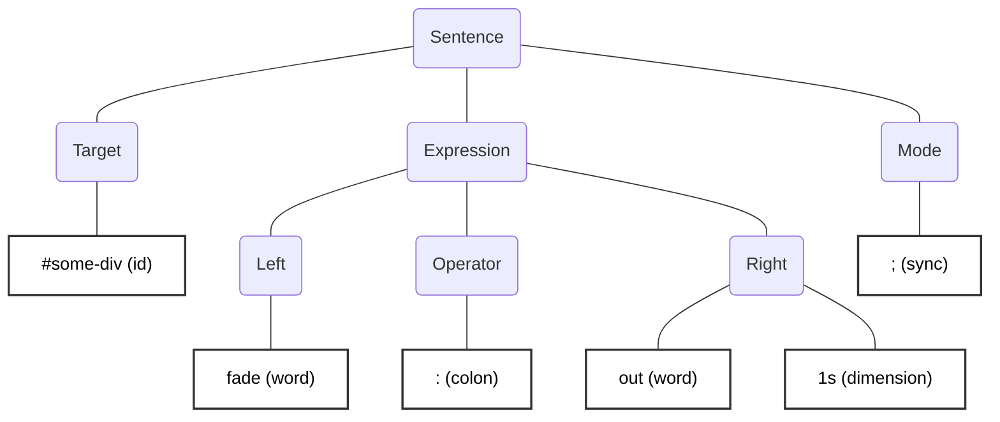

# act

> [](CHANGELOG.md)
> [](LICENSE)

> [!CAUTION]
> **This is not even a beta. Breaking changes may occur without notice.**


```html
<script src="act.js"></script>
<button act@click="alert: `Just act, don't react!`">Click me!</button>
```

**act** is a scripting language for HTML.

<details>
<summary>Table of Contents</summary>

- [What?](#what)
- [Why?](#why)
- [Getting Started](#getting-started)
    - [Installation](#installation)
    - [In a nutshell](#in-a-nutshell)
- [Core Concepts](#core-concepts)
    - [Events](#events)
    - [Language](#language)
    - [Values](#values)
    - [Data Scopes](#data-scopes)
    - [act Blocks](#act-blocks)
    - [Sentences](#sentences)
- [Language Reference](#language-reference)
    - [Expressions](#expressions)
    - [Operators](#operators)
    - [Prefixes](#prefixes)
    - [Keywords](#keywords)
    - [Signals](#signals)
- [Act Library](#act-library)
    - [Element Methods](#element-methods)
    - [Object/Collection Methods](#objectcollection-methods)
    - [Array Methods](#array-methods)
    - [String Methods](#string-methods)
    - [Global Methods](#global-methods)
    - [Window Functions](#window-functions)
    - [Reserved Words](#reserved-words)
- [Events Reference](#events-reference)
    - [Event Binding](#event-binding)
    - [Multiple Events](#multiple-events)
    - [IntersectionObserver Events](#intersectionobserver-events)
    - [The `act` Event](#the-act-event)
    - [Event Modifiers](#event-modifiers)
    - [Key Modifiers](#key-modifiers)
    - [Event Aliases](#event-aliases)
    - [Custom Events](#custom-events)
    - [Lifecycle Events](#lifecycle-events)
- [Advanced](#advanced)
    - [Configuration](#configuration)
    - [Extensions](#extensions)
    - [Public API](#public-api)
    - [Results and Solving](#results-and-solving)
    - [Act.abortable](#actabortable)
    - [htmx Integration](#-htmx-integration-act-htmxjs)
- [Testing](#testing)
    - [Running Tests](#running-tests)
- [TypeScript Support](#typescript-support)
- [Editor Support](#editor-support)
- [Security](#security)
- [Contributing](#contributing)

</details>

## What?

- ⤵️ Add it to your HTML with just a `script` tag: no compilation, no dependencies, no build process, no shenanigans

- 📍 act code is put right into HTML elements using attributes or script tags, embracing **[locality of behaviour](https://htmx.org/essays/locality-of-behaviour/)**

- 🎯 All the code is parsed when the DOM is ready and then executed on standard DOM events

- 🎉 Supports literal `{query selectors}`, `#ids`, `.classes`, `<tags>`, `@attributes`, `*css-properties` and dimensions (`12px`, `1.2rem`, `400ms`, `100%`, ...)

- ⏳ Handles synchronous and asynchronous code with ease

- 🤝 JavaScript classes and functions are available within act code

- ⭕️ Aims to have a compact syntax

- 🧩 Easily extensible through a simple JavaScript API

- 🙋 act focuses in ease of use, not performance

- 🧑‍💻 Syntax highlighting for VSCode, Neovim, Zed, TextMate, Visual Studio and JetBrains IDEs

- 🫡 Inspired by great libraries like [**_hyperscript**](https://hyperscript.org/), [**surreal**](https://github.com/gnat/surreal) and [**intercooler.js** `ic-action`](https://intercoolerjs.org/attributes/ic-action).

- 🐴 Simple integration with [**htmx**](https://htmx.org/) v2 and [v4](https://four.htmx.org/), using the `act-htmx.js` script

- 🫨 It's unstable and highly experimental

## Why?

**JavaScript**, oh JavaScript... Love it or hate it, it's right there.\
As it gets more features, I feel that it has lost some focus.\
One of JavaScript's basic use cases, DOM manipulation, still feels cumbersome and verbose.\
**act** aims to address this by providing a more concise and expressive way to manage DOM interactions that is right there, in the elements themselves.

Let's look at this simple example:

```html
<button id="hide-btn">When I'm clicked I will hide after 1 second.</button>
...
<script>
    document.addEventListener('DOMContentLoaded', () => {
        document.getElementById('hide-btn').addEventListener('click', (e) => {
            setTimeout(() => {
                e.target.style.display = 'none';
            }, 1000);
        });
    });
</script>
```

Now we are used to it, we've seen or even write code like this for years. But... when you think about it, it's a lot of code and it's not like we want to do some very complex stuff: just hide the button after 1 second.

You could write that with an `onclick` attribute, but that is [frowned upon](https://developer.mozilla.org/en-US/docs/Web/HTML/Reference/Attributes#event_handler_attributes):

```html
<button onclick="setTimeout(() => { this.style.display = 'none'; }, 1000);">When I'm clicked I will hide after 1 second.</button>
```

It's like JavaScript is begging to be abstracted away.

```html
<button id="hide-btn">When I'm clicked I will hide after 1 second.</button>
...
<!-- A lot of HTML later... -->
<script>
    $(document).ready(function() {
        $('#hide-btn').click(function(e) {
            setTimeout(function() {
                $('#hide-btn').hide();
            }, 1000);
        });
    });
</script>
```

Well... yeah... We've been there before. A little bit of this is fine I guess, but as the code grows (and it doesn't need to grow that much) it gets hard to locate, manage and maintain.

```bash
npx create-react-app my-app
```

Wait, wait... You really wanna go there?

Could there be another way?

> grug much prefer put code on the thing that do the thing. now when grug look at the thing grug know the thing what the thing do, alwasy good relief!
>
> -[_The Grug Brained Developer_](https://grugbrain.dev/#grug-on-soc) on Separation of Concerns

With act the behavior is expressed in this compact way within the button itself:

```html
<button act@click="wait: 1s; hide!;">When I'm clicked I will hide after 1 second.</button>
```

## Getting Started

### Installation

Simply include the `act.js` file in your HTML. No build steps required. You can vendor it or use a CDN.

```html
<script src="act.js"></script>
```

### In a nutshell

```html
<button 
    act="fade: out 500ms; fade: in 500ms; repeat;"
    act@click="kill act"
>
    I will stop fading in and out when you click me!
</button>


<div id="one" style="width: 100px; height: 100px; background-color: red;">
    <script type="text/act">
        transition: color to blue in 1s; 
        transition: color to red in 1s;
        repeat;
    </script>
</div>
<div id="two" style="width: 100px; height: 100px; background-color: green;">
    <script type="text/act">
        transition: color to yellow in 1s; 
        transition: color to green in 1s; 
        repeat;
    </script>
</div>
<button act@click="#one toggle!; #two toggle!">Toggle divs</button>
<button act@click="#one kill act; #two kill act">Stop animations</button>


<h1>AI Dinner suggester 2000</h1>
<ul id="dinner-list" act@click:target="confirm: `Remove {:inner_text}?` ? remove!">
    <li>Pizza</li>
    <li>Pasta</li>
    <li>Salad</li>
    <li>Sushi</li>
    <li>Steak</li>
</ul>
<button class="button">
    <script type="text/act" act@click>
    with new <li>, do
        $name: prompt: 'Name of the dinner item:';
        not $name? stop;
        << $name;
        #dinner-list append: me;
    end;
    </script>
    Add a new dinner item
</button>
<button class="button"> 
    <script type="text/act" act@click>
        $items: {#dinner-list li};
        $decided: random: 0 ($items.length - 1);
        alert: `Today I suggest {$items[$decided].inner_text} for dinner!`;
    </script>
    Decide dinner!
</button>
```

> [!NOTE]
> Remember to follow a healthy diet, exercise regularly, and drink plenty of water.

## Core Concepts

### Events

Act code runs in response to events. You attach code to elements using the `act@eventname` attribute:

```html
<button act@click="fade: out">Click to fade out</button>
```

Or use `<script type="text/act" act@eventname>` tags for longer code:

```html
<button>
    <script type="text/act" act@click>
        fade: out;
        wait: 1s;
        fade: in;
    </script>
    Click me
</button>
```

Common events: `click`, `input`, `submit`, `mouseover`, etc. You can also use custom events.

The special `act` event runs when the page loads (on `DOMContentLoaded`).

→ [See detailed Events documentation](#events-reference) for modifiers, aliases, and custom events.

### Language

Act code is composed of **Scopes**, containing a list of **Sentences**. These sentences have **Expressions** that use **Values**.

#### Syntax Fundamentals

**Sentences** → [See Sentences](#sentences)

Act code is written in sentences. Each sentence typically performs one action:

```act
#my-element hide!;
```

Sentences end with a terminator (`;` by default). Multiple sentences are written one after another:

```act
#box1 hide!;
wait: 1s;
#box2 show!;
#box3 fade: in 1s&   // & terminator is used to run the sentence asynchronously
#box4 fade: out 1s;
```

**Target and Operation** → [See Sentence target](#sentence-target)

Most sentences follow this pattern: `target operation arguments`

- **Target**: What you want to act on (element, variable, etc.). If not specified, it defaults to the element where the act code is located.
- **Operation**: What you want to do (method, keyword, operator)
- **Arguments**: Data needed for the operation

```act
#my-element hide!;              // Target: #my-element, Operation: call hide
$name: 'John';                  // Operation: assignment
alert: 'Hello!';                // Operation: call alert
```

**Calling Methods** → [See Call](#call)

Methods are called with `!` and can take arguments using `!:`:

```act
#element hide!;                  // No arguments
#element fade!: out 500ms;       // With arguments
$array push!: 'item';            // Method on a variable
```

**Accessing Properties** → [See Values](#values)

Properties use prefixes to indicate what type of property you're accessing:

```act
#input :value;                  // DOM property (:)
#element *background-color;     // CSS property (*)
#element @disabled;             // HTML attribute (@)
```

The **colon operator** (`:`) is the **Act operation** - it automatically infers whether to **set** or **call** based on the **type** of value on the left:

```act
// Set (when left is a property, attribute, CSS property, or variable)
#input :value: 'text';           // Property: sets value
#input value: 'text';            // Word that resolves to a property: sets value
#element *background: red;       // CSS property: sets background
#button @disabled: true;         // Attribute: sets disabled
$name: 'John';                   // Variable: sets variable

// Call (when left is a word/method name)
fade: in 500ms;                  // Word: calls fade method
alert: 'Hello!';                 // Word: calls alert function
```

**Explicit set** → [See Set](#set)

You can use the `=` operator to explicitly set a value, without inferring the operation:

```act
#input :value = 'text';           // Property: sets value
#input value = 'text';            // Word that resolves to a property: sets value
#element *background = red;       // CSS property: sets background
#button @disabled = true;         // Attribute: sets disabled
$name = 'John';                   // Variable: sets variable
```

**Working with Variables** → [See Data Scopes](#data-scopes)

Variables start with `$`:

```act
$text: 'Hello';
```

Variables starting with a capital letter are **global**:

```act
$Global_var: 'accessible everywhere';
$scoped_var: 'only in this scope';
```

You can also use the `global`, `local` and `scoped` prefixes to specify explicitly the variable scope:

```act
global $global_var: 'accessible everywhere';
local $local_var: 'only in this element';
scoped $scoped_var: 'only in this scope';
```

**Selecting Elements** → [See Values](#values)

Elements can be selected using familiar CSS-like syntax:

```act
#my-id                          // ID selector
.my-class                       // Class selector (returns collection)
<div>                           // Tag selector (returns collection)
{div > .item}                   // Selector template (query)
```

**Keywords** → [See Keywords](#keywords)

Use `if`, `each`, `while`, and other keywords for logic:

```act
each $item in $list (
    log: $item;
);

if $name is 'John' (
    alert: 'Hello John!';
);
```

**Scopes** → [See Sentences](#sentences)

Group multiple sentences using parentheses `()` or `do...end`.
Scopes allow to create scoped variables, only accessible in the current scope and its children.

```act
(
    wait: 1s;
    show!;
);

do
    $x: 10;
    log: $x;
    (
        log: `I will print 10: {$x}`;
    );
end;

do
    log: $x;  // It will not print 10 as this is a different scope and $x is not defined.
end;
```

**Operators** → [See Operators](#operators)

Common operators work as expected:

```act
$sum: 1 + 2;
$product: 3 * 4;
$is_equal: $a is $b;
$is_greater: $x > 5;
```

**String Templates** → [See Values](#values)

Use backticks for string interpolation:

```act
$name: 'World';
log: `Hello, {$name}!`;         // Interpolate variables
log: `Sum: {1 + 2}`;            // Interpolate expressions
```

### Values

| Type | Description | Example |
| --- | --- | --- |
| **String** | Text wrapped in single or double quotes. Supports escape characters like `\n` or `\t`. | `"Hello\nworld!"`, `'Hello\nworld!'` |
| **Word** | An unquoted string containing only alphanumeric characters, underscores, and dashes. Some words are [reserved](#reserved-words). | `aliceblue`, `red`, `hello-world` |
| **Number** | Integers or decimal numbers. | `123`, `1.23`, `-12.3` |
| **Boolean** | True or false values. | `true`, `false` |
| **Variable** | A word prefixed by `$`. Used to store and retrieve values. | `$some_variable`, `$someVariable` |
| **CSS Property** | A CSS property of the target element. Prefixed by `*`. | `*background-color`, `*opacity` |
| **Dimension** | A number with a unit (px, rem, em, s, ms, %, etc.). | `123px`, `1.23rem`, `3s`, `50%` |
| **Attribute** | An HTML element attribute. Prefixed by `@`. | `@disabled`, `@data-value` |
| **Property** | A property of the [target](#sentence-target). Prefixed by `:`. | `:innerText`, `:value` |
| **Null** | Represents no value. | `null` |
|| **DOM REFERENCES** ||
| **Id** | An HTML element ID. Prefixed by `#`. Returns the element with that ID. | `#some-id`, `#header` |
| **Class** | An HTML element class. Prefixed by `.`. Returns all elements with that class. Append `!` to select only the **first** matching element directly. | `.some-class`, `.button`, `.button!` |
| **Tag** | An HTML tag. Wrapped in `<>`. Returns all elements with that tag. Append `!` to select only the **first** matching element directly. | `<div>`, `<button>`, `<div>!` |
|| **COLLECTIONS** ||
| **Array** | A list of values separated by spaces or commas, wrapped in `[]`. | `[1 2 3]`, `["a", "b", "c"]` |
| **Object** | Key-value pairs separated by colons, wrapped in `[]`. Keys and values can be separated by spaces or commas. Use `[:]` as an empty object. | `[key1: value1 key2: value2]`, `[name: 'John', age: 30]` |
|| **TEMPLATES** ||
| **String Template** | A string with interpolations wrapped in backticks. Interpolations use `{}` and can contain full sentences. | `` `Hello {$name}!` ``, `` `Result: {2 + 3}` `` |
| **Selector Template** | A CSS query selector wrapped in `{}`. Returns matching elements. Supports interpolations and [prefixes](#selector-template-prefixes). Append `!` to select only the **first** matching element directly. | `{#some-div}`, `{p > .class}`, `{#{$id}}`, `{> a.active}!` |
|| **EVALUABLES** ||
| **Scope** | A collection of sentences wrapped in `()` or `do ... end`. Can hold values, expressions, or multiple sentences. | `(2 + 3)`, `do wait: 1s; log: 'Done' end` |
| **Function** | An anonymous function defined with `->`. Can have arguments. Returns the value of the last sentence or using `return`. | `->( log: 'Hi' )`, `-> $x $y ($x + $y)` |
|| **COMMENTS** | Yes, comments are not values but I didn't know where to put them |
| **Single line comments** | Single line comments start with `//` and continue until the end of the line. | `// This is a single line comment` |
| **Multi line comments** | Multi line comments start with `/*` and end with `*/`. They can span multiple lines. | `/* This is a multi line comment`<br />`That spans multiple lines */` |
|| **VALUES WE WISH DIDN'T EXIST** ||
| **undefined** | 🤷 | `undefined` |
| **Not a number** | `'a' * 1` | `NaN` |

> [!NOTE]
> **Automatic Case Conversion & JavaScript Method Access**
> 
> When accessing properties or calling methods, act automatically converts **snake_case** to **camelCase**.
> This means you can write `:inner_text` to access `innerText`, or `query_selector_all` to call `querySelectorAll`.
> 
> **You can call any native JavaScript method** on values using this conversion. For example:
> - `$number.to_string: 16` calls the native `toString(16)` method
> - `#my-element focus!` calls the native `focus()` method
> - `$string.to_upper_case!` calls the native `toUpperCase()` method
> 
> This makes act seamlessly integrate with the entire JavaScript API using the **superior** snake_case.

#### Selector Template Prefixes

Selector templates are not just a convenient way to call `document.querySelectorAll` under the hood, they have **prefixes** that alter the query behavior.

| Prefix | Description | Example |
| --- | --- | --- |
| `< ...` | Returns the [closest](https://developer.mozilla.org/en-US/docs/Web/API/Element/closest) element that matches the CSS query | `{< div.button}`, `{< p}` |
| `> ...` | Returns the elements that match the CSS query inside the current element. Can be used with selectors. | `{> p > span.highlighted}`, `{> a}` |

> [!TIP]
> Append `!` after a selector template (or any DOM Reference like `.class` or `<tag>`) to select the **first** matching element directly, instead of returning a NodeList. This is equivalent to using `querySelector` instead of `querySelectorAll`.
> ```act
> {> a.active}!     // first matching <a class="active"> inside the current element
> .button!          // first element with class 'button'
> <li>!            // first <li> element on the page
> ```

### Data Scopes

Variables in act have three possible scopes: **global**, **local (element)**, and **scoped**.

#### Global Scope

Variables in the global scope are variables that can be accessed from all places within the page.
They are declared with the `$` prefix and an **initial capital letter**.
You can also access and declare global variables using the `global` prefix.

```html
<div id="user-profile">
    <input type="text" name="user-name" act@input="$Name: :value">
    <!-- ... -->
</div>
<!-- ... -->
<!-- Somewhere else on the page -->
<div id="some-other-div">
    <button id="some-other-action">
        <script type="text/act" act@click>
            not $Name?
                alert: 'Please complete your profile first!'
            ~ do
                $Name is 'John'? 
                    alert: 'Sorry but John is not allowed to do that.'
                ~ 
                    alert: 'OK!';
            end;
        </script>
        Do some stuff!
    </button>
</div>
```

> [!NOTE]
> Global variables are stored in the `body` element. The variable lookup code goes directly to the `body` element when the variable name starts with a capital letter or the `global` prefix is used.

#### Local (Element) Scope

Variables in the local scope are variables that can be accessed only within the element where they are declared and its children.

They are declared using the `local` prefix, and the name of the variable cannot start with a capital letter.

```html
<div id="some-div" act="local $some_var: 1; $another_var: 1;"><!-- Both variables are 1 -->
    <button id="some-button" act@click="alert: `$some_var is {$some_var}, and $another_var is {$another_var}`">
        Click me!
    </button>
</div>

<div act="local $foo: 1">
    <!-- Here $foo is 1, $bar is undefined, $baz is undefined -->
    <div act="local $bar: 2">
        <!-- Here $foo is 1, $bar is 2, $baz is undefined -->
        <div act="local $baz: 3">
            <!-- Here $foo is 1, $bar is 2, $baz is 3 -->
        </div>
    </div>
</div>
```

#### Scoped Variables

Scoped variables are variables that can be accessed only within the Scope where they are declared and its nested scopes.

They are declared using the `scoped` prefix, and the name of the variable cannot start with a capital letter.

Variables that are not declared with any prefix are considered scoped variables.

```html
<section id="some-section" act="local $section_var: 3">
    <div id="some-div" act="scoped $some_var: 1; local $another_var: 1; log: $section_var;">

        <button id="some-button"> 
            <script type="text/act" act@click>
                // Here $some_var is undefined, not defined in the same Scope.
                // $another_var is 1, as it is declared at the local scope.
                alert: `$some_var is {$some_var}, and $another_var is {$another_var}`;

                scoped $foo: 10;

                do
                    log: $foo;  // $foo looked up. Logs 10.
                    scoped $foo: 20;  // $foo defined as a scoped variable in THIS Scope.
                    log: $foo;  // Logs 20.
                    log: $section_var;  // Logs 3. $section_var is available as a local variable of a parent element.
                end;

                log: $foo;  // Logs 10.
            </script>
            Click me!
        </button>
    </div>
</section>
```

### act Blocks

act Blocks are a way to write reusable code that can be invoked within the element where the block is defined or any of its children.

Blocks can be defined in two ways:
1. Using a `<script type="text/act">` tag with an `act-block` attribute (value: `block_name $arg1 $arg2 ...`)
2. Using the [`def` keyword](#def) inline within act code

When the `run` keyword is used, the block will be executed in the current sentence target, which is the target specified or inherited in the `run` sentence and not the element where the block is defined. This way the block can be easily reused with different targets.

By default, `run` looks for the block by walking up the ancestor chain of the source element, then the sentence target. To reach a block that lives in a different part of the DOM (a sibling subtree, a shared component, and so on), use `from` followed by a selector pointing to the element where the block is defined (or any of its ancestors):

```html
run my_block from #component arg1 arg2;
```

#### Block Arguments

Arguments are defined in the `act-block` attribute after the block name, using variable syntax (prefixed with `$`). These become named parameters that you pass when calling `run`.

```html
<div id="user-profile">
    <script type="text/act" act-block="check_field $border_color">
        if value.length < 2 or :value is 'John' (
            *border: 5px solid $border_color;
            @invalid: true;
            first {> .field-info} << 'Please enter a valid name';
         ) else (
            *border: 1px solid green;
            remove_attribute: invalid;
            first {> .field-info} << empty!;
        );
    </script>
    
    <input type="text" act@input="debounce: 250ms run check_field firebrick;">
    <p class="field-info"></p>
    
    <input type="text" act@input="debounce: 250ms run check_field orangered;">
    <p class="field-info"></p>
</div>
```

Arguments are optional - if an argument is not provided when calling `run`, the variable will be `undefined` within the block.

**Multiple Arguments Example:**

```html
<script type="text/act" act-block="greet $name $title">
    alert: `Hello {$title} {$name}!`;
</script>

<button act@click="run greet 'Smith' 'Dr.'">Greet Dr. Smith</button>
<button act@click="run greet 'Johnson' 'Prof.'">Greet Prof. Johnson</button>
```

> [!WARNING]
> While act blocks are useful, avoid overusing them or you'll end up searching for where things are defined and what they do, which can get messy fast. Don't _jQueryit_.

### Sentences

Values and expressions are placed in **sentences**, each one may contain an optional **target** at the beginning and an execution **mode** at the end that also indicates the end of the sentence.


```mermaid
graph TD
    S(Sentence)
    T(Target)
    E(Expression)
    M(Mode)
    
    S --- T
    S --- E
    S --- M
    
    T --- TV["#some-div (id)"]
    
    L(Left)
    O(Operator)
    R(Right)
    
    E --- L
    E --- O
    E --- R
    
    L --- LV["fade (word)"]
    O --- OV[": (colon)"]
    R --- RV1["out (word)"]
    R --- RV2["1s (dimension)"]
    
    M --- MV["; (sync)"]
    
    style TV fill:#fff,stroke:#333,stroke-width:2px,color:#000
    style LV fill:#fff,stroke:#333,stroke-width:2px,color:#000
    style OV fill:#fff,stroke:#333,stroke-width:2px,color:#000
    style RV1 fill:#fff,stroke:#333,stroke-width:2px,color:#000
    style RV2 fill:#fff,stroke:#333,stroke-width:2px,color:#000
    style MV fill:#fff,stroke:#333,stroke-width:2px,color:#000
```

#### Sentence target

The target of a sentence is the value where the expression of the sentence will be applied, the target of the action. This can be an element or any other value.
If a target is not specified, the sentence will look up for a target from its ancestors. If no target is found, it will use the element where the code is located (or the target of the event if the [target modifier](#event-modifiers) is used on the event).

The use of targets is useful to target other elements using IDs, classes, tags and Query templates:

```html
<div id="just-a-squared-div" class="square" style="width: 100px; height: 100px; background-color: red;"></div>
<div id="another-squared-div" class="square" style="width: 100px; height: 100px; background-color: green;"></div>

<button class="toggable" act@click="#just-a-squared-div *background-color: red">
    Make the first square background red
</button>
<button class="toggable" act@click="<div>[0] *background-color: green">
    Make the first square background green
</button>
<button class="toggable" act@click="first {.square} *background-color: blue">
    Make the first square background blue
</button>
<button class="toggable" act@click="<div> each (*background-color: `rgb({random: 0 255}, {random: 0 255}, {random: 0 255})`)">
    Random background for both divs!
</button>
<button act@click=".toggable each toggle!">
    Toggle the buttons
</button>
```

#### Sentence mode

The mode of a sentence is defined by the **last token** of the sentence, which acts as the sentence terminator.
These are the tokens that can be used to finish a sentence and define its mode:

| Token | Mode | Description |
| --- | --- | --- |
| **`;`** | Synchronous | The standard mode terminator. The sentence executes synchronously - the next sentence waits for this one to complete. |
| **`&`** | Asynchronous | The sentence executes **asynchronously** - the next sentence starts immediately without waiting for this one to complete. |
| **`>>`** | Forward | Forwards the sentence result as the target of the next sentence (piping). |
| **`?`** | Condition | Conditional sentence. If the result is truthy, the next sentence executes; if falsy, it's skipped. |
| **`~`** | Branch | Conditional branch. Executes if the previous condition was false, skips if it was true. |

**Examples:**

```act
// Synchronous execution (;) - waits for each step
wait: 0.5s;
log: "I'll be logged after 0.5 seconds.";
#some-element transition: background-color to red in 2s;
log: "I'll be logged after the transition ends (2 seconds).";

// Asynchronous execution (&) - doesn't wait
#some-element transition: background-color to green in 3.5s &
log: "I'll be logged immediately. The transition runs in the background.";

// Conditional execution (?)
$a_variable: true;
$a_variable? log: "I'll be logged because $a_variable is true.";

// Conditional with else
$a_variable?
    log: "I'll be logged because $a_variable is true."
~
    log: "This sentence will be skipped.";
```

## Language Reference

### Expressions

Expressions perform an **operation** involving a **left** operand, and zero or more values as **right** operands (arguments) separated by spaces.

```act
left (operation token) right1 right2 right3
```

If needed, an expression can be terminated by a comma `,`. For instance if you want to use expressions as arguments, you can do it like this:

```act
log: has_attribute: data-someattr, 2 + 3
```

>This will log into the console `true` and `5` as the comma acts as a terminator for the `has_attribute: data-someattr` expression, and `5` is treated as the next argument of log and not the next argument of has_attribute.
>
>If that is too much for you, wrapping arguments into Scopes is a good alternative:\
>`log: (has_attribute: data-someattr) 2 + 3`
>
>Or if the expression are calls you can also use the call with parentheses syntax:\
>`log: has_attribute(data-someattr) 2 + 3`\
>`log(has_attribute(data-someattr), 2 + 3)`

#### Call

`left!` or `left!: right`\
It also accepts parentheses syntax:\
`left()` or `left(right, right, ...)`.

The call operation calls the left operand, if callable, or looks up for a function named after the left operand and calls it.

- Looks up a method from the [act Library](#act-library) that matches the value as name and the target type.
    - `#some-element empty!`
- Call the method with the value as name in the target object.
    - `#some-element remove!;`
- Call the method with the value as name in the **`window`** global object.
    - `alert!: 'Hello world!';`

It can be also used to call an anonymous function.

```act
// Declaring a simple function to use later:
$greet: -> $name (
    alert: `Hello {$name}!`;
);

#some-div hide!;  
// Calls the hide method for an Element target type from the act Library.

alert: 'Hello world!';  
// No method 'alert' found on the Library or the target, falling back to window and calling window.alert.
alert('Hello world!');
// This also works but it's less fun.

$greet: 'Foo';  
// Calls the anonymous function with the argument 'Foo'.

$greet('Foo');  // Calls the anonymous function with the argument 'Foo' again, using parentheses syntax.
```

#### Set

`left = right`.

The set operation sets the right operand to the left operand.
If the left operand is or evaluates to an Element it will set its inner_html property.
If the left operand is a CSS Property it will set all the right operands.

```act
#some-div *border = '1px solid red';  
// Sets the CSS property border of #some-div to 1px solid red.

$a = 1;  
// Declares or sets the variable $a to 1.

$b[3] = 'foo';
$c.property = 'bar';
// It also sets members of arrays and properties of objects.

<button>[4] @disabled = true;  
// Sets the disabled attribute of the 5th button to true.

#long-text inner_html = 'tl;dr';  
// Sets the inner_html property of #long-text to 'tl;dr'.

#short-text (inner + HTML) = 'wall of text here';  
// Sets the inner_html property of #short-text. The value is a scope that evaluates to the concatenated words 'inner' and 'HTML', so you can effectively use any value as long as it evaluates to a string.

#medium-text `inner{'html'.to_upper_case!}` = 'meh';  
// Sets the inner_html property of #medium-text to 'meh'. Again, the value in this case is not a word but a string template.
```

#### Act

`left: right`

🍭 The act operation is just sweet sweet **syntactic sugar** 🍬. Depending on the type of the left operand it will either use a `set` or a `call` operation.

```act
*border: 1px solid red;  
// CSS property as left operand: uses a set operation and sets the border property to 1px solid red.
// With CSS properties the right operands list is joined with a space.

$a: 1;  
// Variable as left operand: uses a set operation and sets the variable $a to 1.

@disabled: true;  
// Attribute as left operand: uses a set operation and sets the disabled attribute to true.

:property: 5;
// Property as left operand: uses a set operation and sets the property to 5.

fade: in 100ms;  
// Word as left operand: uses the call operation and calls the fade method of the act Library with the right operands 'in' and '100ms'.

inner_html: 'bah';  
// Word as left operand: uses the call operation, as no method is found sets the inner_html property to 'bah'.

```

#### At

`left.right`.

The `at` operation is used to access keys or properties of the left operand.

```act
$fruits: [Orange Apple Banana];
$human: [
    name: 'John'
    say_hello: ->(
        log: `My name is {$this.name}!`;
    )
];

$human.say_hello!;
// Logs 'My name is John!'.

$human.name: 'Johnny';  // Or $human[name] = 'Johnny';
$human.say_hello!;
// Logs 'My name is Johnny!'.

$fruits[0]: 'Apricot';
$fruits.push: 'Peach';
log: $fruits[4].to_upper_case!;  
// It calls the toUpperCase method of the string 'Peach' and logs 'PEACH'.
```

#### Safe At

`left?.right`

Like the `at` operation, but returns `undefined` instead of throwing if the left operand is `null` or `undefined`. The safe flag propagates through the rest of the chain, so `a?.b.c` returns `undefined` if `a` is `null` rather than throwing on `.c`.

Mixed chains work naturally: `a.b?.c.d` creates two separate access expressions: `.b` is unsafe (throws if `a` is `null`) and `?.c.d` is safe (returns `undefined` if `a.b` is `null`).

```act
$user: null;
$user?.name;        // undefined, no throw

$data: [meta: null];
$data.meta?.title;  // undefined: .meta is safe, .title propagates
```

#### Subscript

`left[right]`

The subscript operation looks up for a property or index named after the right operand (index) and returns it.
The index can be a value or an expression.
Unlike the `at` operation, the subscript operation only accesses the strict result of the right operand without performing any lookup or case conversion.

> [!NOTE]
> One more expression, **insert** (`<<`), appends content into a single element or pushes into an array. Because it reads like an operator, it's documented in [Operators](#operators) (`#div << 'Content'`).

### Operators 

`left operator right`

> [!IMPORTANT]
> **Strict Operator Spacing**
> Operators **MUST** be surrounded by spaces.
> - ✅ `1 + 1`
> - ❌ `1+1` (This will be parsed as a text string or invalid token, not an addition)
>
> This rule applies to all operators (`+`, `-`, `=`, `==`, etc.) to ensure clear and unambiguous parsing as act allows the use of kebab-case keywords.

> [!CAUTION]
> **Operators have no precedence** and are solved **left to right**.
>
> So `1 - 2 + 3 * 4 + 5` will result in **`13`** instead of `16`.
> - 1 - 2 = `-1`
> - -1 + 3 = `2`
> - 2 * 4 = `8`
> - 8 + 5 = `13`
>
> Please use parentheses to avoid this:\
> `1 - 2 + (3 * 4) + 5` will be evaluated as **`16`**.
>
> **Why?** Because as this side project has grown out of control (and sanity), the parser was not meant for the stuff I was shoving into it, and I'm just too lazy to implement it.\
> Will the laziness ever be defeated? idk.

| Operator | Description | Example |
| --- | --- | --- |
|| **ARITHMETIC** ||
| `+` | Addition and string concatenation | `1 + 2`, `'Hello ' + 'world'` |
| `-` | Subtraction | `1 - 2` |
| `*` | Multiplication | `1 * 2` |
| `/` | Division | `1 / 2` |
| `%` | Modulo (division remainder) | `10 % 3` |
|| **LOGIC** ||
| `and` | And | `$foo and $bar` |
| `or` | Or | `$isLoggedIn or #username-field.has_attribute: disabled` |
| `??` | Nullish coalescing. Returns the left operand if it is not `null` or `undefined`, otherwise the right. Unlike `or`, falsy values like `0` or `''` pass through. | `$user?.name ?? 'Anonymous'` |
| `not` | Logical negation. This is a **[prefix](#not)**, not a binary operator, so it takes only a right operand. | `not $isLoggedIn` |
|| **COMPARISON** ||
| `is` | Equal (JavaScript `===`) | `1 is 2` |
| `is_not` | Not equal (JavaScript `!==`) | `1 is_not 2` |
| `==` | Like (JavaScript `==`) | `'1' == 1  // is true` |
| `!=` | Not like (JavaScript `!=`) | `'1' != 1  // is false` |
| `>` | Greater than | `1 > 2` |
| `>=` | Greater than or equal | `1 >= 2` |
| `<` | Less than | `1 < 2` |
| `<=` | Less than or equal | `1 <= 2` |
|| **ASSIGNMENT** ||
| `=` | Set the left operand to the right operand | Check the [Set operation](#set) section |
| `+=` | Add and set. Works with numbers and strings. | `$a += 1`, `$str += ' more'` |
| `-=` | Subtract and set. | `$a -= 1` |
|| **OTHER** ||
| `as` | Cast the left operand to the type specified in the right operand. Documented in the next section ([here](#as-operator)). | |
| `rescue` | If an exception is thrown on the left operand evaluation, the right operand expression or scope will be evaluated. Documented [here](#rescue-operator). | |
| `is_a` or `is_an` | Checks if the left operand is an instance of the specified type. | `1 is_a number`, `$some_array is_an array`, `#some-element is_an element` |
| `then` or `\|` | Uses the result of the left expression as the target for the right expression. | `'foo' as id then :value`, `'foo' as id \| :value` |
| `is_in` | Checks if the left operand is in the right operand (collection or string). | `'a' is_in 'abc'`, `1 is_in [1 2 3]` |
| `is_not_in` | Checks if the left operand is not in the right operand. | `'d' is_not_in 'abc'` |
| `<<` | Inserts the right operand into the left operand. If left is a **single element**, sets `innerHTML`. If the right operand is a `<template>` element, it inserts the template's `innerHTML`. If left is an array, pushes the value. Collections are not accepted, so select one element with `!` or `first`. | `#div << 'Content'`, `#div << #my-template`, `.item! << 'Content'`, `$arr << 1` |

> [!NOTE]
> All **arithmetic and comparison** operators can be used with **dimensions** if both operands are dimensions with the **same dimension unit**.
>```act
>100px + 2px  // valid, returns 102px
>100px > 2rem  // not valid, returns null
>```

#### `as` operator

`left as right`

The `as` operator is used to cast the **left** operand to the type specified in the **right** operand.
It accepts the following types:

| Type | Description | Example |
| --- | --- | --- |
| `string` | Casts the left operand to a string. | `9 as string` |
| `number` | Casts the left operand to a number, if it cannot be cast to a number it returns 0. | `'1.2' as number`, `'not a number' as number  // returns 0` |
| `float` | Casts the left operand to a float. | `'1.2' as float` |
| `int` | Casts the left operand to an integer. | `'23' as int` |
| `integer` | Alias for `int`. | `'23' as integer` |
| `boolean` | Casts the left operand to a boolean. | `'false' as boolean` |
| `id` | Casts the left operand to an id. | `'#some-id' as id` or `'some-id' as id` |
| `class` | Casts the left operand to a class. | `'.some-class' as class` or `'some-class' as class` |
| `attribute` | Casts the left operand to an attribute of the target. | `'@some-attribute' as attribute` or `'some-attribute' as attribute` |
| `css_property` | Casts the left operand to a CSS property of the target. | `'*some-property' as css_property` or `'some-property' as css_property` |
| `dimension` | Casts the left operand to a dimension. | `'1.2rem' as dimension` |
| `variable` | Casts the left operand to a variable name. | `'foo' + 'bar' as variable` |
| `json` | Serializes the left operand to a JSON string using `JSON.stringify`. | `$obj as json` |
| `fragment` | Parses the left operand as HTML and returns a `DocumentFragment`. | `'<p>Hello</p>' as fragment` |
| `selector` | Casts the left operand to a selector template. | `'.my-class' as selector` |

#### `rescue` operator

`left rescue right`

If an exception is thrown on the **left** operand evaluation, the **right** operand expression or scope will be evaluated.
If the **right** operand is a scope, the thrown exception of the **left** operand will be injected into the scope as the `$exception` variable.

```act
(#nonexistent-id *color: red) rescue (log: 'Unable to set the color of #nonexistent-id to red, the exception was:' $exception);
```

This can, of course, also be written in multiple lines:

```act
(
    #nonexistent-id *color: red;
) rescue (
    log: 'Unable to set the color of #nonexistent-id to red, the exception was:' $exception;
);
```

#### Error Handling Patterns

The `rescue` operator provides similar capabilities to JavaScript's `try...catch` blocks. Here are common patterns:

**Basic Error Recovery:**

```act
// Try to fetch data, fallback to default
$data: (fetch: '/api/data' then json!) rescue ['name': 'Default'];
```

**Accessing the Error:**

```act
// The $exception variable contains the caught exception
#risky-operation do
    // Some operation that might fail
    throw 'Something went wrong!';
end rescue (
    error: 'Caught exception:' $exception;
    // $exception contains the error message or Error object
);
```

**Chaining with throw:**

```act
// Validate and throw custom errors
$age: prompt: 'Enter your age:';
($age as number) < 18? throw: 'Must be 18 or older';

// Handle validation errors
(
    run validate_form;
) rescue (
    #error-message << `Error: {$exception}`;
    #error-message show!;
);
```

### Prefixes

Prefixes are special words that modify the value or expression that follows them.

#### `not`

Negate the value that follows.

#### `local`

Looks up or declares a variable at the **local (element) scope**.
> [!NOTE]
> Scopes are explained in the **[Data Scopes](#data-scopes)** section.

```act
local $a;
// Declares a variable $a with a null value.

local $b: 2;
// Declares a variable $b with a value of 2.

local $c: 2 + $b;
// Declares a variable $c with the result of the expression: a value of 4.

do
    log: $a; 
    // $a is found in the local scope, logs null.

    $a: 10;
    // Sets variable $a to 10.

    log: $a;
    // Logs 10.
end;

log: $a;
// Logs 10.
```

#### `global`

Looks up or declares a variable at the **global scope**.
> [!NOTE]
> Scopes are explained in the **[Data Scopes](#data-scopes)** section.

```act
global $a: 1;
// Declares a global variable $a with a value of 1.
```

#### `scoped`

Looks up or declares a variable at the **scoped scope**.
> [!NOTE]
> Scopes are explained in the **[Data Scopes](#data-scopes)** section.

```act
scoped $a: 1;

do
    log: $a;
    // Looks up for the $a variable; $a is found in the parent Scope, logs 1.

    scoped $a;
    // Declares a variable $a with a null value in this Scope.

    scoped $b: 2;
    // Declares a variable $b with a value of 2 in this Scope.

    $a: 10;
    // Sets scoped variable $a to 10.

    log: $a;
    // Finds $a variable in this Scope, logs 10.
end;

log: $a;
// Logs 1.
```

#### `negative`

Prefix that negates a number (unary minus operator). The shorthand `-` can be used directly before any value or expression.

Examples:

```act
negative 5;    // Returns -5
-5;            // Same

$a: 10;
negative $a;   // Returns -10
-$a;           // Same

-(2 + 4);      // Returns -6
```

#### `type`

Returns the type name of a value as a string.

Examples:

```act
type 5;
// Returns 'number'

type #some-div;
// Returns 'element'

type [1, 2, 3];
// Returns 'array'
```

#### `first`

Returns the first item in a collection.

Examples:

```act
first .item *color: red;
// Selects the first element with class 'item' and sets its color to red.

$my_array: [1 2 3];
first $my_array; // Returns 1
```

#### `last`

Returns the last item in a collection.

Examples:

```act
last .item *color: blue;
// Selects the last element with class 'item' and sets its color to blue.

$my_array: [1 2 3];
last $my_array; // Returns 3
```

#### `wat`

Debug helper that logs detailed information about a value to the console, including its type, value, and origin. The value will be returned.

Examples:

```act
wat $some_variable;
// Logs detailed debug info about $some_variable
```

#### `...` (Spread)

The spread prefix expands arrays into individual values. This is useful for:
- Passing array elements as separate arguments to functions
- Merging arrays together
- Creating new arrays with additional elements

```act
// Store an array
$numbers: [1 2 3];

// Spread as function arguments
log: ...$numbers;           // Logs 1, 2, 3 as separate arguments

// Spread into a new array
$more: [...$numbers 4 5 6]; // Creates [1, 2, 3, 4, 5, 6]

// Combine arrays
$a: [1 2];
$b: [3 4];
$combined: [...$a ...$b];   // Creates [1, 2, 3, 4]
```

### Keywords

#### `if`

```act
if condition (
    // This Scope will be evaluated if the condition is true.
) else if other_condition (
    // This Scope will be evaluated if the first condition is false and this condition is true.
) else (
    // This Scope will be evaluated if all preceding conditions are false.
);

#some-element if :inner_html.includes: 'foo', (
    alert: 'The element has the word "foo" in its innerHTML';
) else if :inner_html.includes: 'bar', (
    alert: 'The element has the word "bar" in its innerHTML';
) else (
    alert: 'The element does not have the word "foo" or "bar" in its innerHTML';
);
```

> [!NOTE]
> **A note on act's simple but expressive syntax.**
>
> `if`, like the other keywords, is just one big expression with multiple Words and Scopes 
> as lazy evaluated arguments.\
> act syntax is very simple, but it also allows for some expressive code.\
> With that said, let's get back to our scheduled programming...

#### `each`

Iterate over a collection.

Arguments:

- With an **iterable target**: `(body: Expression or Scope)`
- With an **iterable argument**: `(key: variable) ('in' Word) (iterable value) (body: Scope)` 
- With an **Object**: `(key: variable) (value: variable) ('in' Word) (Object) (body: Scope)`

```act
<p> each (
    // The target inside this Scope will be set to each paragraph.
    << inner_html.to_upper_case!;
)

each $item in [1 2 3 4] (
    log: $item;
    $item is 3? log: 'Three is my favorite number!';
);

// Some object
$act_todo: [
    'Lexer': 'Slow but working'
    'Parser': 'Done'
    'Literal Values': 'Done'
    'Scope evaluation': 'Done'
    'Fix bugs': false
];

each $feature $status in $act_todo (
    if not $status (
        warn: `The feature {$feature} is not done yet.`;
    ) else if $status is_not 'Done' (
        log: `The feature {$feature} is done but may have some rough edges: {$status}.`;
    ) else (
        log: `The feature {$feature} is done.`;
    );
);
```

#### `for`

A _BASIC_ style `for` loop.

Arguments:
`(variable) [ ('from' Word) (start value) ] ('to' Word) (end value) [ ('step' Word) (step value) ] (body: Scope)`

```act
for $i to 10 ( // Starts at 0, ends at 10.
    log: $i;
);

for $i from 1 to 10 ( // Specifies a starting value.
    log: $i;
);

for $i from 1 to 10 step 2 ( // Specifies a step value that increments the variable on each iteration.
    log: $i;
);

for $i from 0 to <p>.length step 2 (
    // I will change the color of every odd <p> element.
    <p>[$i].*color: red;
);
```

#### `while`

A `while` loop.

Arguments:
`(condition: value) (body: Scope)`

```act
$i: 0;
while $i < 10 (
    log: `The current index is {$i}.`;
    $i += 1;
);
```

> If the condition is initially `false`, the body is never executed.

#### `loop`

Executes a scope in an infinite loop. Use `break` to exit the loop.

Arguments:
`(Scope)`

```act
loop (
    warn: 'This loop is running forever!';
);

// Loop with a break condition:
$count: 0;
loop (
    $count += 1;
    log: `Count: {$count}`;
    $count >= 5? break;
);
```

```html
<div id="looper" act="loop (wait: 1s; log: 'Running...')">
    <button act@click="#looper kill act">Stop the loop</button>
</div>
```

#### `def`

Defines a named block of code on the target.

Arguments:
`(name: Word) [arguments...] (body: Scope)`

```act
def hello do
    log: 'Hello, world!';
end;

def greet $name (
    log: `Hello, {$name}!`;
);

run greet 'World';

// Variadic arguments (rest parameter)
def sum_all ...$numbers (
    $sum: 0;
    each $n in $numbers ( $sum += $n );
    log: $sum;
);

run sum_all 1 2 3 4;
```

#### `run`

Run a named block of code defined with the `act-block` attribute or the `def` keyword in the target.

```html
<script type="text/act" act-block="my_block">
    log: 'Block executed';
</script>

<button act@click="run my_block">Run Block</button>
```

Blocks can accept named arguments:

```html
<script type="text/act" act-block="greet $name $greeting">
    log: `{$greeting}, {$name}!`;
</script>

<button act@click="run greet 'John' 'Hello'">Greet John</button>
```

By default, the block is looked up by walking up the ancestor chain of the source element and then the sentence target. Use `from` to reach a block defined elsewhere in the DOM:

```html
<!-- Block defined in a sidebar, unrelated to the button -->
<aside id="shared-blocks">
    <script type="text/act" act-block="validate $value">
        log: `Validating: {$value}`;
    </script>
</aside>

<form>
    <button act@click="run validate from #shared-blocks 'hello'">Validate</button>
</form>
```

The `from` argument goes **right after the block name** and tells `run` to start the block lookup at that element (walking up its ancestors as usual), instead of walking up from the sentence target. Any arguments after the `from` element are passed to the block as normal.

→ [See act Blocks](#act-blocks) for detailed documentation on defining and using blocks with arguments.


#### `with`

Sets the target of the body scope.

Arguments:
`(target: value) (body: Scope)`

```act
with #some-element (
    fade: out;
    // Fades out #some-element.

    #another-element hide!;  
    // Hides #another-element, as the explicit target of this sentence is #another-element and it will not fallback to the target of the "with" operation.
);

// It also works with other values that are not elements:
$some_array: [1 2 3];
with $some_array (
    push: 4;
    // Pushes value 4 to the end of $some_array.
);
```

#### `new`

Creates a new HTML element or a new instance of a JavaScript class/prototype/or whatever that thing works.

Arguments:

- `(Tag or Word) [args...]`

```act
$a_div: new <div>;
// Creates a new div HTML element.

$date: new Date;
// Creates a new JavaScript Date object.

$custom_date: new Date '2023-12-25';
// Creates a new Date object with arguments.
```

#### `on`

Adds an event listener to the target element.
> [!WARNING]
> Be careful when adding event listeners. Act only stores one event listener per event name per element.\
> So while adding multiple event listeners that have the same name to an element works, removing an event listener with `off` will only remove the last one.

Arguments:

- `(event name: Word) (body: Scope)`: basic event binding
- `(event name: Word) (options: Object) (body: Scope)`: with an options object
- `(event name: Word) [...options: Word] (body: Scope)`: with single-word options
- `(event name: Word) [...options: Word] matching (selector) (body: Scope)`: event delegation
- `([alias name: event name]: Object) [...options: Word] [matching (selector)] (body: Scope)`: aliased event

**Single-word options:** Any word before the scope becomes `options[word] = true`. Common options:
- `target`: handler receives `event.target` as `me` instead of the bound element
- `once`: handler fires only once
- `capture`, `passive`: passed through to `addEventListener`
- `prevent`: calls `event.preventDefault()`
- `stop`: calls `event.stopPropagation()`
- `only`: calls `event.stopImmediatePropagation()`

Examples:

```act
// Basic event
#some-element on click (
    log: 'Clicked!';
);

// With single-word options
#some-element on click target once (
    log: 'Clicked on:' me;
);

// Event delegation with matching
#some-list on click matching {.item} (
    log: 'Item clicked!';
    *color: red;
);

// Aliased event
#some-element on [myClick: click] (
    log: 'Aliased click!';
);

// Combined: alias + options + matching
#container on [itemClick: click] target matching {button.active} (
    log: 'Active button clicked:' :inner_text;
);

// With options object
#some-element on scroll [passive: true] (
    log: 'Scrolling...';
);

// With modifiers - only trigger on Ctrl+Click
#some-element on click [modifiers: ['ctrl']] (
    log: 'Ctrl+Click detected!';
);

// Combined: modifiers with single-word options
#some-element on click target [modifiers: ['ctrl' 'shift']] (
    log: 'Ctrl+Shift+Click on:' :tag_name;
);
```

#### `off`

Removes an event listener from the target element.

Arguments:
`(event name or alias: Word)`

```act
#some-element off click;
#some-element off custom-event;
```

#### `kill`

Halts all currently running contexts of a specific event on the target element **immediately**. The running sentence is abandoned, and any in-flight [abortable](#actabortable) operation (like `transition` or `wait`) runs its abort handler, **reverting** the element to its pre-operation state. This is useful for stopping long-running or infinite loops triggered by events.

For a graceful stop that lets the current sentence complete, use [`finish`](#finish).

Arguments:
`(event name: Word)`

Examples:

```html
<div id="looper" act="loop (wait: 1s; log: 'Running...')">
    <button act@click="#looper kill act">Stop the loop</button>
</div>
```

Returns `true` if contexts were running and halted, `false` otherwise.

#### `finish`

The graceful counterpart to [`kill`](#kill): the sentence that is currently executing completes normally (a running 3-second `transition` plays out its 3 seconds), and then execution stops at the next sentence boundary, so no further sentences run. In-flight [abortable](#actabortable) operations are **not** aborted.

Arguments:
`(event name: Word)`

Examples:

```html
<div id="looper" act="loop (transition: opacity to 0.2 in 1s; transition: opacity to 1 in 1s)">
    <button act@click="#looper kill act">Stop now (reverts the running transition)</button>
    <button act@click="#looper finish act">Stop after the current transition</button>
</div>
```

Returns `true` if contexts were running, `false` otherwise.

#### `wait_until`

Pauses execution until the target element dispatches the specified event, then resumes. Returns the event object. If the running context is [killed](#kill), the listener is removed.

Arguments:
`(event name: Word)`

```act
(wait: 2s; trigger: ready) &
wait_until ready;
log: 'The ready event fired!';

#dialog wait_until close;
log: 'The dialog was closed';
```

#### `throw`

Throws an exception. If no exception is specified, it will throw an `ActError` exception.

Arguments:
`[optional exception: Error instance or message]`

Examples:

```act
throw;
// Throws a generic ActError

throw 'Something went wrong!';
// Throws ActError with custom message

throw new Error 'Custom error';
// Throws a specific Error instance
```

#### `case`

A switch-like keyword for matching a value against multiple options.

Arguments:
`(value) when (match) (body: Scope) [when (match) (body: Scope) ...] [else (body: Scope)]`

Use `when` for **strict** comparison (`===`) and `like` for **loose** comparison (`==`):

```act
$color: 'red';
case $color
when 'red' (
    log: 'The color is red!';
)
when 'blue' (
    log: 'The color is blue!';
)
else (
    log: `Unknown color: {$color}`;
);

// Using "like" for loose comparison (==)
$value: 1;
case $value
like '1' (
    log: 'Loosely matches the string "1"';
)
like true (
    log: 'Loosely matches true';
);

// case returns the result of the matched branch
$message: case $status
when 'ok' 'All good!'
when 'error' 'Something went wrong!'
else 'Unknown status';
log: $message;
```

> Unlike JavaScript's `switch`, `case` has **no fall-through behavior**: only the first matching branch executes, and execution continues after the `case` statement.

#### `debounce`

Executes a scope or expression with **debounce**, specifying the time as the first argument.

Arguments:
`(duration: dimension) (scope: Scope)`

Examples:

```act
debounce 500ms ( log: 'Debounced' );
```

#### `lock`

Locks the current scope or a specific event, preventing further evaluations until it is unlocked.

Arguments:

- No arguments: Locks the current event scope
- `(boolean)`: Sets lock state for current event scope
- `(event name)`: Locks a specific event on the target element
- `(event name, boolean)`: Sets lock state for specific event

Examples:

```act
lock;
lock click;
lock scroll false;
```

#### `unlock`

Unlocks the current scope or a specific event, allowing further evaluations.

Arguments:
`[event: string]`

Examples:

```act
unlock;
unlock click;
```

#### `is_locked`

Checks if the event execution is locked.

Arguments:
`[event: string]`

Returns `true` if the event is locked, `false` otherwise.

Examples:

```act
is_locked? log: 'Locked';
```

### Signals

Act has a few statements called signals that can be used to control the execution flow of a scope. They are [keywords](#keywords) that work by throwing a control-flow signal which the enclosing loop, scope, or function catches. They are grouped separately here because they steer execution rather than compute a value.

#### `break`

Breaks the execution of the current scope on an `each`, `loop`, `for` or `while` operation. It may take an optional value that acts as a return value.

Arguments:
`[value]`

```act
$i: 0;
$result: while $i < 10 (
    $i += 1;
    if $i == 5 (
        break 'Done';
    );
);
```

#### `continue`

Ends the current iteration: iterates and continues the execution of the current scope on an `each`, `loop`, `for` or `while` operation.

```act
$i: 0;
loop (
    $i += 1;
    $i % 2 is 0? continue;
    $i >= 20? break;
    log: $i;
    // Logs odd numbers 1, 3, 5, ..., 19
);
```

#### `repeat`

Repeats the execution of the current scope.

```act
// ...
log: 'Looping forever!';
repeat;
```

#### `restart`

Restarts the execution of the root scope.

```act
// ...
$name: prompt: 'What is your name?';
$age: prompt: 'How old are you?';
if $name == 'John' and $age < 18 (
    restart;  // Goes back to the top!
);
// ...
```

#### `stop`

Stops the execution of the current scope. It can also return a value.

Arguments:
`[value]`

```act
$username == 'John' ? stop 'John found';
// If the username is John, the execution of the current scope will be stopped and the value 'John found' will be returned.
```

#### `halt`

Ends the execution. It can also return a value.

Arguments:
`[value]`

```act
// ...
$name: (#username-field :value.to_upper_case!);
log: 'Hello {$name}!';
if $name is 'JOHN' and #age-field.value as number < 18 (
    halt;
);
// ...
```

#### `return`

End the execution of a Function and returns a value.

Arguments:
`[value]`

```act
$validate: -> $name (
    $name == 'John'? return 'John found';
    // ...
    return 'John not found';
);
```

## Act Library

> The methods listed below are provided by act. Additionally, when calling a method on a value, if the method isn't found in the act library, it **falls through to the native JavaScript prototype** for that value. This means all native JS methods are also available on any value.

### Element Methods

These methods are available on Element targets.

#### `hide`

Hides the target element (sets `display: none`).

Arguments:
_None_

```act
#some-element hide!;
```

#### `show`

Shows the target element (removes `display: none`).

Arguments:
_None_

```act
#some-element show!;
```

#### `transition`

Executes a transition on the target element.

Arguments:
`(CSS property Word) [('from' Word) (value)] ('to' Word) (value) ('in' Word) (duration: time dimension) [('using' Word) (timing function Word)] [after (delay: time dimension)], ...`

Different properties can be specified on the same call.

Examples:

```act
#some-element transition: transform from 'scale(1)' to 'scale(0.75)' in 0.5s 
background-color to white in 1s color to black in 1s;

#some-element transition: background-color from red to black in 250ms using ease-in-out after 10s &
// This transition will take 10 seconds + 250 milliseconds to complete, but as the sentence is asynchronous it will not wait for the transition to finish before continuing.

#some-element transition: border-color to #ff0 in 500ms width to (*width + 50px) in 750ms using linear;
```

#### `move_to`

Moves the target element to a new position in the DOM relative to the specified element.

Arguments:
`(target: Element) [position: Word]`
Position can be: `beforebegin`, `afterbegin`, `beforeend`, `afterend`. Defaults to `beforeend`.

Aliases:

- `before` -> `beforebegin`
- `prepend` -> `afterbegin`
- `append` -> `beforeend`
- `after` -> `afterend`
- `inside` -> `innerhtml` (replaces innerHTML)
- `replace` -> `outerhtml` (replaces the element itself)

Examples:

```act
#some-element move_to: #new-parent;
#some-element move_to: #new-parent afterbegin;
{< p} move_to: first <article> append;
```

#### `empty`

Removes all children of the element.

Arguments:
_None_

```act
#some-element empty!;
```

#### `clone`

Creates a deep clone of the element (including all descendants).

Arguments:
_None_

Examples:

```act
$copy: #some-element.clone!;
#container append: #template.clone!;
```

#### `prepend`

Prepends content to the start of the target element (as first child).

Arguments:
`(content: string or Element)`

Examples:

```act
#some-element prepend: 'Hello';
#some-element prepend: '<p>First paragraph</p>';
#some-element prepend: new <div>;
```

#### `append`

Appends content to the end of the target element (as last child).

Arguments:
`(content: string or Element)`

Examples:

```act
#some-element append: 'World';
#some-element append: '<p>Last paragraph</p>';
#some-element append: new <div>;
```

#### `set_html`

Replaces the inner HTML of the target element. When [`sanitize: true`](#html-sanitization) is configured (a sanitizer function must be provided), the HTML string is passed through the sanitizer before insertion.

Arguments:
`(content: string or Element)`

```act
#some-element set_html: '<p>New content</p>';
```

#### `set_outer_html`

Replaces the element itself with the provided content. When [`sanitize: true`](#html-sanitization) is configured (a sanitizer function must be provided), the HTML string is passed through the sanitizer before insertion.

Arguments:
`(content: string or Element)`

```act
#some-element set_outer_html: '<section>Replacement</section>';
```

#### `remove`

Removes the target element from the DOM, or removes one or more classes/attributes from the element.

Arguments:
- No arguments: removes the element from the DOM
- `.class` (one or more): removes each specified class
- `@attribute` (one or more): removes each specified attribute

```act
#some-element remove!;                        // Removes the element from DOM
#some-element remove: .active;                // Removes the 'active' class
#some-element remove: @disabled;              // Removes the 'disabled' attribute
#some-element remove: .active .highlighted;   // Removes multiple classes at once
```

#### `has`

Checks if the element matches a selector, class, or attribute presence.

Arguments:
`(selector or class or attribute)`

- Returns true if the element matches the selector or has the class/attribute.
- Returns false otherwise.

Examples:

```act
#some-element has: .active;
    // Element has class 'active'

#some-element has: @disabled;
    // Element has attribute 'disabled'
```

#### `toggle`

Toggles visibility, class, or attribute on the target element.

Arguments:

- No arguments: Toggles element visibility (show/hide)
- `(class or attribute)`: Toggles the specified class or attribute
- `(class or attribute, force: boolean)`: Sets class/attribute to specific state

Examples:

```act
#some-element toggle!;
// Toggles visibility

#some-element toggle: .active;
// Toggles the 'active' class

#some-element toggle: @disabled;
// Toggles the 'disabled' attribute

#some-element toggle: .selected true;
// Forces the 'selected' class to be added
```

#### `add`

Adds one or more classes or attributes to the target element.

Arguments:
`(class or attribute) [class or attribute ...]`

- If a class (e.g., `.my-class`) is provided, it adds the class to the element's classList
- If an attribute (e.g., `@data-custom`) is provided, it adds an empty attribute to the element

Examples:

```act
#some-element add: .active;
// Adds the 'active' class

#some-element add: @data-enabled;
// Adds the 'data-enabled' attribute with an empty value

#some-element add: .active @data-enabled;
// Adds both in one call
```

#### `is_in_view`

Checks if the target element is visible in the viewport.

Arguments:
`[partially: boolean]`

Returns:

- `true` if fully visible
- `'partially'` if partially visible (when first argument is `true`)
- `false` if not visible

Examples:

```act
#some-element is_in_view! ? log: 'Visible';
#some-element is_in_view: true;
// Returns 'partially' if any part is visible
```

#### `next`

Gets the next element sibling, optionally matching a selector.

Arguments:
`[selector]`

Examples:

```act
#some-element.next! *color: red;
#some-element.next: .item;
```

#### `previous`

Gets the previous element sibling, optionally matching a selector.

Arguments:
`[selector]`

Examples:

```act
#some-element previous! *color: blue;
#some-element previous: .item;
```

#### `parent`

Returns the parent node of the target element.

Arguments:
_None_

```act
#some-element parent! *border: 1px solid black;
```

#### `matches`

Checks if the target element matches a CSS selector.

Arguments:
`(selector)`

Examples:

```act
#some-element matches: .active ? log: 'It is active';
#some-element matches: {div.container > p};
```

#### `take`

Takes an attribute or class from other elements and applies it to the target element, removing it from the source elements.

Arguments:
`(attribute or class) [parent: Element]`

The optional `parent` argument is the element to search within for elements that currently hold the class or attribute. Defaults to `this.parentNode` (siblings).

Examples:

```act
#some-element take: .active;
// Takes 'active' class from siblings (parent defaults to parentNode)

#some-element take: @disabled;
// Takes 'disabled' attribute from siblings

#some-element take: .selected #my-list;
// Takes 'selected' class from elements inside #my-list
```

#### `fade`

Fades the target element in or out.

Arguments:
`('in' or 'out' Word) [time dimension = 250ms] [timing function Word = 'linear']`

Examples:

```act
#some-element fade: out 1s;
#some-element fade: in 500ms ease-in-out;
#some-element fade: out;   // defaults to 250ms linear
```

### Object/Collection Methods

#### `move_to`

Moves all elements in the collection to a target element and position. Uses the same position values as the Element method.

Arguments:
`(target: Element) [position: Word]`
Position can be: `beforebegin`, `afterbegin`, `beforeend`, `afterend`. Defaults to `beforeend`.
Aliases:

- `before` -> `beforebegin`
- `prepend` -> `afterbegin`
- `append` -> `beforeend`
- `after` -> `afterend`
- `inside` -> `innerhtml` (replaces innerHTML)
- `replace` -> `outerhtml` (replaces the element itself)

Examples:

```act
last .item move_to: #container;
last .moved-item move_to: #container prepend;
```

#### `trigger`

Dispatches an event on the target.

The target must be an **event target**: an element, but also `window` or `document`. Triggering on a value that cannot dispatch (a plain object, an array) throws.

Arguments:
`(eventName: string) [bubbles: boolean] [detail: object]`

- `eventName` - The name of the event
- `bubbles` - Whether the event should bubble (default: `true`)
- `detail` - Custom data to pass with the event (default: `empty object`)

Examples:

```act
#my-element trigger: click;
#my-element trigger: data_updated true [id: 123, status: complete];
#my-element trigger: notification false [message: 'Hello!'];

js trigger: app_ready;              // on window
document trigger: theme_changed true [theme: 'dark'];
```

### Array Methods

#### `map`

Creates a new array with the results of calling a provided function on every element in the calling array.

Arguments:
`(function)`

```act
$nums: [1 2 3];
$doubled: $nums.map: -> $x ($x * 2);
```

#### `filter`

Creates a new array with all elements that pass the test implemented by the provided function.

Arguments:
`(function)`

```act
$nums: [1 2 3 4];
$evens: $nums.filter: -> $x ($x % 2 == 0);
```

#### `for_each`

Executes a provided function once for each array element.

Arguments:
`(function)`

```act
$nums: [1 2 3];
$nums.for_each: -> $x (log: $x);
```

#### `find`

Returns the first element in the provided array that satisfies the provided testing function.

Arguments:
`(function)`

```act
$users: [[name: 'Alice' id: 1] [name: 'Bob' id: 2]];
$user: $users.find: -> $u ($u.id == 2);
```

#### `find_index`

Returns the index of the first element in the array that satisfies the provided testing function.

Arguments:
`(function)`

```act
$nums: [10 20 30];
$idx: $nums.find_index: -> $x ($x > 15); // Returns 1
```

#### `some`

Tests whether at least one element in the array passes the test implemented by the provided function.

Arguments:
`(function)`

```act
$nums: [1 2 3];
$has_even: $nums.some: -> $x ($x % 2 == 0); // Returns true
```

#### `every`

Tests whether all elements in the array pass the test implemented by the provided function.

Arguments:
`(function)`

```act
$nums: [2 4 6];
$all_even: $nums.every: -> $x ($x % 2 == 0); // Returns true
```

### String Methods

#### `after`

Returns the substring after the first occurrence of the specified value.

Arguments:
`(value: string)`

```act
'hello world'.after: ' '; // Returns 'world'
```

#### `before`

Returns the substring before the first occurrence of the specified value.

Arguments:
`(value: string)`

```act
'hello world'.before: ' '; // Returns 'hello'
```

#### `between`

Returns the substring between the first occurrence of the start value and the first occurrence of the end value.

Arguments:
`(start: string) (end: string)`

```act
'hello [world]'.between: '[' ']'; // Returns 'world'
```

#### `capitalize`

Capitalizes the first character of the string.

Arguments:
_None_

```act
'hello'.capitalize!; // Returns 'Hello'
```

### Global Methods

#### `wait`

Waits for a specified duration.

Arguments:
`(duration: dimension)`

Examples:

```act
wait: 1s;
wait: 150ms;
wait: 500; // integers are treated as miliseconds
```

#### `log`

Logs the provided arguments to the console.

Arguments:
`(values...)`

Examples:

```act
log: 'Hello' $name;
```

#### `warn`

Logs a warning to the console.

Arguments:
`(values...)`

Examples:

```act
warn: 'Something is wrong';
```

#### `error`

Logs an error to the console.

Arguments:
`(values...)`

Examples:

```act
error: ':(';
```

#### `time_to_ms`

Converts a time dimension to milliseconds.

Arguments:
`(time: dimension)`

Examples:

```act
$ms: time_to_ms: 1s; // 1000
```

#### `random`

Generates a random number between min and max.

Arguments:
`(min: number) (max: number)`

Examples:

```act
$num: random: 1 10;
```

#### `tick`

Waits for the next animation frame.

Arguments:
_None_

Examples:

```act
tick!;
```

#### `listens_to`

Checks if an element listens to an event.

Arguments:
`(event: string)`

Examples:

```act
#btn listens_to: click;
```

#### `is_running`

Checks if a bound element has a specific event running. If no event is specified, checks if any event is running.

Arguments:
`[event: string]`

Examples:

```act
#btn is_running! ? log: 'Running';
#btn is_running: click;
```

#### `log_raw`

Logs the raw value (useful for debugging Result instances).

Arguments:
`(value: any)`

Examples:

```act
log_raw: $result;
```

### Window Functions

If the specified name does not match any property, Library method or target method, it will be called from the global `window` object.

```act
// Alert
alert: 'Hello world!';

// Confirm
confirm: 'Are you sure?' ? log: 'User confirmed';

// Prompt
$name: prompt: 'What is your name?';

// LocalStorage
local_storage.set_item: 'theme' 'dark';
$theme: local_storage.get_item: 'theme';
```

### Reserved Words

#### `document`

The global `document` object.

```act
log: document.title;
```

#### `window` or `js`

The global `window` object.

```act
log: window.inner_width;
log: js.inner_width;
```

#### `Act`

The Act library public API.

```act
log: Act.version;
```

#### `me`

Refers to the current target.

```act
[1 2 3] each ( log: me );
```

#### `source_element`

The element where the code is placed.

```act
log: source_element;
```

#### `original_target`

The initial execution target of the current context: the element the act code was dispatched on at the start of execution, before any target changes (e.g. via `with`).

```act
log: original_target;
```

#### `debugger`

Triggers a breakpoint in the browser's developer tools.

```act
debugger;
```

#### `true`

Boolean `true` literal.

```act
$is_active: true;
```

#### `false`

Boolean `false` literal.

```act
$is_disabled: false;
```

#### `null`

The `null` value.

```act
$value: null;
```

#### `undefined`

The JavaScript `undefined` value.

```act
$result: undefined;
log: undefined;
```

#### `NaN`

The JavaScript `NaN` (Not-a-Number) value.

```act
$invalid: NaN;
0 / 0 == NaN; // false (NaN is never equal to itself)
```

## Events Reference

This section provides detailed documentation on how events work in act.

### Event Binding

Act code is placed directly on HTML attributes and script elements, and it runs on standard events like `click`, `mouseover` and `submit`. You can use your own custom events too.

Add the code and bind it to an event with an attribute `act@eventname`:

```html
<button act@click="fade: out">Fade me out!</button>
```

You can also put the code on a script tag with the `type="text/act"` attribute, and an empty `act@eventname` attribute:

```html
<button>
    <script type="text/act" act@click>
        fade: out;
    </script>
    Fade me out!
</button>
```

Code in script tags will be bound to the element that is the direct parent of the script tag.

#### The `$event` variable

Inside any event handler the triggering DOM event is available as `$event`:

```act
log: $event.type;           // e.g. 'click'
log: $event.target;         // the element that was clicked
log: $event.detail;         // custom data for CustomEvents
```

For the `act` initialization event, `$event` is the synthetic `Event` object dispatched by act.

### Multiple Events

Multiple events can be mapped to the same attribute by separating the event names with commas:

```html
<button act@click,mouseleave="fade: out">Fade me out!</button>
```

You can add multiple attributes with multiple events and/or multiple script tags:

```html
<button act@mouseleave="*color: gray" act@click="*color: green">
    <script type="text/act" act@keyup>
        *color: red;
    </script>
    <script type="text/act" act@mouseenter>
        *color: blue;
    </script>
    Multi-colored button
</button>
```

### IntersectionObserver Events

**act** provides the `inview` and `offview` events based on the [`IntersectionObserver` API](https://developer.mozilla.org/en-US/docs/Web/API/Intersection_Observer_API) that trigger when an element is in or out of the viewport:

```html
<p act@inview="fade: in; *color: red;" act@offview="*color: blue; fade: out;">
    I fade in when I'm in the viewport and fade out when I'm out of the viewport.
</p>
```

These events support **event delegation** using the [`on`](#on) keyword with the `matching` option, allowing you to observe visibility changes on child elements:

```html
<ul id="items">
    <script type="text/act">
        on inview matching <li> (add: .seen);
        on offview matching <li> (remove: .seen);
    </script>
    <li>Item 1</li>
    <li>Item 2</li>
    <li>Item 3</li>
</ul>
```

Each `<li>` element will receive the `.seen` class when it enters the viewport and lose it when it leaves. The observation is set up on child elements that match the selector, and new elements added dynamically will also be observed.

### The `act` Event

The special `act` event is triggered when Act initializes (on `DOMContentLoaded`). You can use it to run initialization code:

```html
<div act="log: 'Element initialized'">
    <!-- This code runs when Act starts -->
</div>

<main act="run init_app">
    <script type="text/act" act-block="init_app">
        // Initialization logic here
        log: 'App initialized';
    </script>
</main>
```

The `act` event also fires when new elements are initialized via `Act.init(root)`. This is useful for frameworks like htmx that dynamically load HTML content, since newly inserted elements with `act` attributes will have their `act` event triggered upon initialization.

### Event Modifiers

You can add modifiers to events by appending a `:modifier` to the event attribute name.

| Modifier | Description | Example |
| --- | --- | --- |
| `:once` | Adds the `once` option to the event making the event only trigger once. | `act@keyup:once` |
| `:target` | It sets the act target to the element where the event was triggered instead of defaulting to the element where the act code is located. | `act@click:target` |
| `:prevent` | Prevents the default behavior of the event, calling `preventDefault()`. | `act@submit:prevent` |
| `:stop` | Stops the propagation of the event, calling `stopPropagation()`. | `act@click:stop` |
| `:only` | Stops the immediate propagation of the event, calling `stopImmediatePropagation()`. | `act@click:only` |

Multiple event modifiers can be added to the same event:
`act@click:target:once:stop`

### Key Modifiers

For keyboard events (like `keyup`, `keydown`) and mouse events, you can filter the event by appending specific keys or modifier keys using **dots** `.`. Modifiers are case-insensitive (converted to lowercase internally):

| Modifier | Description | Example |
| --- | --- | --- |
| `.key` | Triggers only when the specified key is pressed. Works with any key name (e.g., `enter`, `escape`, `a`, `z`). | `act@keyup.enter`, `act@keydown.escape` |
| `.modifier` | Requires specific modifier keys (shift, ctrl, alt, meta) to be pressed. | `act@click.shift`, `act@keydown.ctrl.s` |

You can chain multiple modifiers to create complex key combinations:

```html
<!-- Trigger only on Enter key -->
<input act@keyup.enter="submit!">

<!-- Trigger on Shift + Enter -->
<textarea act@keyup.shift.enter="new_line!"></textarea>

<!-- Trigger on Ctrl + S -->
<div act@keydown.ctrl.s="save!">Save</div>

<!-- Shift-click to delete -->
<button act@click.shift="delete!">Delete (Shift-Click)</button>
```

### Event Aliases

Event aliases allow you to give a different name to an event handler, which is useful when you need multiple handlers for the same event type or want to use descriptive names with `kill` or `off`.

Append `#alias` to the event:

```html
<button act@click#my_handler="log: 'Handler 1'" act@click#another_handler="log: 'Handler 2'">
    Click me - both handlers will fire
</button>

<button act@click="kill my_handler">
    Stop only the first handler
</button>
```

This is particularly useful with the `act` event when you want to stop specific initialization handlers:

```html
<div act@act#animation="fade: out 500ms; fade: in 500ms; repeat;">
    <button act@click="kill animation">Stop animation</button>
</div>
```

> [!NOTE]
> HTML lowercases attribute names, so aliases are effectively case-insensitive: `act@click#saveForm` registers `saveform`, and `kill saveForm` will **not** find it. Stick to lowercase or snake_case alias names.

### Bracketed Event Names (for names containing `:` or `.`)

The parts of an event attribute are separated by sigils (`:option`, `.key`, `#alias`), so a bare event name ends at the first `:` or `.`. To use those characters **inside** a name, wrap it in brackets, which take it verbatim:

```html
<!-- every htmx event needs brackets -->
<div act@[htmx:before:request]="add: .loading"></div>
<div act@[htmx:after:swap]="log: 'swapped'"></div>

<!-- a custom event containing a dot -->
<div act@[cart.updated]="run refresh_cart"></div>
```

**Any** name may be bracketed, including the alias, and brackets combine with the other parts:

```html
<div act@[htmx:after:swap]#[after.swapping]:once="log: 'once'"></div>
<!-- event: htmx:after:swap   alias: after.swapping   option: once -->
```

Act is strict about this: a name that is not bracketed and contains an unknown `:part` is reported in the console instead of silently binding to the wrong event.

```html
<div act@my:custom:event="..."></div>
<!-- 💣 act: Unknown event option ":custom" in "act@my:custom:event".
     If it is part of a name, wrap the name in brackets: act@[my:custom] -->
```

> [!WARNING]
> Attribute names are lowercased by HTML, so an event whose name contains capitals, such as htmx's `htmx:before:viewTransition`, **cannot** be bound from an attribute at all. Use the [`on`](#on) keyword with a quoted string, which preserves case:
> ```html
> <script type="text/act">
>     on 'htmx:before:viewTransition' ( log: 'transitioning' );
> </script>
> ```

### Custom Events

Act can listen to **any** event, including custom events that you can dispatch yourself. Simply use `act@your_event_name`:

```html
<div id="my-element" act@my_custom_event="log: 'Custom event received!' $event.detail">
    Waiting for custom event...
</div>
```

You can dispatch custom events from JavaScript:

```js
document.querySelector('#my-element').dispatchEvent(
    new CustomEvent('my_custom_event', { detail: { message: 'Hello!' } })
);
```

Or from Act code using the `trigger` method:

```html
<button act@click="#my-element trigger: my_custom_event true [message: 'Hello from Act!']">
    Trigger from Act
</button>
```

The event data is available through the [`$event` variable](#the-event-variable): `$event.detail` carries custom data passed to the `CustomEvent`.

### Lifecycle Events

act dispatches several **custom DOM events** throughout the execution lifecycle, allowing you to hook into its behaviour. All events bubble.

#### `actready`

Dispatched on `document.body` once when act finishes initializing (after all elements have been scanned and bound). Equivalent to `DOMContentLoaded` but for act.

```js
document.addEventListener('actready', (e) => {
    console.log('Act ready. Bound nodes:', e.detail.bindedNodes);
});
```

| Property | Description |
| --- | --- |
| `detail.bindedNodes` | Array of DOM elements that were bound during initialization. |

#### `actbind`

Dispatched on each element immediately after act has processed and bound it.

```js
document.addEventListener('actbind', (e) => {
    console.log('Element bound:', e.detail.element, e.detail.binding);
});
```

| Property | Description |
| --- | --- |
| `detail.element` | The DOM element that was bound. |
| `detail.binding` | The `Binding` object attached to the element. |

#### `actstart`

Dispatched on the **target element** every time an act event handler begins executing. Fires before the code runs.

```js
document.addEventListener('actstart', (e) => {
    e.target.setAttribute('aria-busy', 'true');
});
```

| Property | Description |
| --- | --- |
| `detail.event` | The triggering DOM event (or `null` for the `act` initialization event). |
| `detail.source` | The act `Source` object (holds the raw code and element reference). |
| `detail.eventManager` | The act `EventManager` instance managing this handler. |

#### `actend`

Dispatched on the **target element** whenever an act event handler finishes executing, whether it completed successfully, was halted, or threw an error. Always fires.

```js
document.addEventListener('actend', (e) => {
    e.target.removeAttribute('aria-busy');
});
```

Shares the same `detail` properties as `actstart`.

#### `acterror`

Dispatched on the **target element** when an act event handler throws a runtime error.

```js
document.addEventListener('acterror', (e) => {
    console.error('Act error:', e.detail.error);
});
```

| Property | Description |
| --- | --- |
| `detail.error` | The JavaScript error that was thrown. If it is an `ActRuntimeError`, `detail.error.actException` holds the original cause and `detail.error.actTrace` holds the act stack trace. |
| `detail.event` | The triggering DOM event. |
| `detail.source` | The act `Source` object. |
| `detail.eventManager` | The act `EventManager` instance. |

#### `actscriptloaded`

Dispatched on the **parent element** of a `<script type="text/act" src="...">` tag once its source has been fetched and is ready to run.

```js
document.addEventListener('actscriptloaded', (e) => {
    console.log('External act script loaded:', e.detail.element);
});
```

| Property | Description |
| --- | --- |
| `detail.element` | The `<script>` element whose source was loaded. |
| `detail.target` | The parent element of the script. |
| `detail.binding` | The `Binding` object of the parent element. |

## Advanced

### Configuration

#### Options

The following options can be configured in Act:

| Option | Type | Default | Description |
| --- | --- | --- | --- |
| `convertToCamelCase` | `boolean` | `true` | Automatically convert `snake_case` properties and method names to `camelCase`. |
| `start` | `boolean` | `true` | Automatically start Act, parsing the code in the elements, binding events and triggering the `act` event when the DOM is ready. |
| `debug` | `boolean` | `false` | Enable debug mode (logs more info). |
| `lexerDebug` | `boolean` | `false` | Enable lexer debug logging. |
| `parserDebug` | `boolean` | `false` | Enable parser debug logging. |
| `startTime` | `boolean` | `true` | Log timing information for `Act.start()` to the console. |
| `sanitize` | `boolean` | `false` | Enable HTML sanitization for `append`, `prepend`, `set_html`, and `set_outer_html`. When `true`, the `sanitizer` function must be provided. |
| `sanitizer` | `function\|null` | `null` | Sanitizer function called with `(element, html)` before any HTML string is inserted. Return a sanitized string to replace the original, or `null` to skip insertion entirely. Required when `sanitize` is `true`. |

#### Setting Configuration

You can configure Act in two ways:

1.  **Meta Tags**: Add `<meta name="act-{option}" content="{value}">` tags in your HTML `<head>`. Keys are in kebab-case and values are JSON-parsed.
    ```html
    <meta name="act-debug" content="true">
    <meta name="act-start" content="false">
    <meta name="act-convert-to-camel-case" content="false">
    ```

2.  **`Act.extend()`**: Register an extension with an `install` hook. This is the recommended approach for JavaScript-based configuration and extensions.
    ```js
    Act.extend({
        install(Act) {
            Act.config.debug = true;
            Act.config.start = false;
        }
    });
    ```

### Extensions

Act's extension system is built around `Act.extend()`, a single entry point for registering plugins before (or after) initialization.

#### `Act.extend(plugin)`

Registers a plugin and returns `Act` for chaining.

```js
Act.extend(plugin);         // single plugin
Act.extend(a).extend(b);    // chained
```

`plugin` can be:

- **A plain object** with optional lifecycle hooks and a `name`
- **A function**, treated as the `install` hook

```js
// Object form
Act.extend({
    name: 'my-plugin',   // optional, useful for debugging

    install(Act) {
        // runs before Act.start()
    },

    ready(Act) {
        // runs after Act.start()
    },
});

// Function shorthand (treated as install)
Act.extend(function (Act) {
    Act.Library.Element.pinkify = function () {
        this.style.backgroundColor = 'pink';
    };
});
```

#### Hooks

| Hook | When it fires | Typical use |
| --- | --- | --- |
| `install(Act)` | Before `Act.start()` | Add library methods, register keywords/prefixes, modify config |
| `ready(Act)` | After `Act.start()` | Access the initialized DOM, set up integrations |

##### `install(Act)`

The `install` hook is used for anything that needs to be in place before Act scans and binds the page. Because parsing happens inside `start()`, any keywords, prefixes, or library methods you register in `install` will be available to every Act expression on the page.

```js
Act.extend({
    install(Act) {
        // configure
        // Enable sanitization
        Act.config.sanitize = true;
        // sanitizer receives (element, html); return the clean string, or null to skip insertion
        Act.config.sanitizer = (element, html) => DOMPurify.sanitize(html);

        // add a library method
        Act.Library.Element.shine = function () {
            this.style.boxShadow = '0 0 12px gold';
        };

        // add a keyword
        Act.Library.keywords.unless = async function (ctx, target, opts, args) {
            const [condition, body] = args;
            if (!(await ctx.asValueOf(condition, target)))
                return await ctx.solve(body, target, opts);
        };

        // add a prefix
        Act.Library.prefixes.maybe = async function (ctx, target, opts, value) {
            try { return await ctx.asValueOf(value, target); }
            catch { return undefined; }
        };
    },
});
```

##### `ready(Act)`

The `ready` hook fires after the initial page scan, equivalent to listening to the `actready` DOM event, but scoped to your plugin.

```js
Act.extend({
    ready(Act) {
        console.log('Act is ready. Extensions:', Act.extensions.length);
    },
});
```

#### Late registration

If `Act.extend()` is called **after** `Act.start()` has already run (e.g. from a dynamically `import()`ed module), both `install` and `ready` fire immediately:

```js
// Loaded lazily, long after DOMContentLoaded
const { myPlugin } = await import('./my-plugin.js');
Act.extend(myPlugin);
// → install() fires right now
// → ready() fires right now
// Any new keywords/methods are available for future Act.init() calls
```

#### `Act.extensions`

A public array of all registered extensions, in registration order. Useful for inspection and debugging:

```js
console.log(Act.extensions.map(e => e.name));
// ['act-ext', 'my-plugin', ...]
```

---

#### What you can extend

##### Library methods (`Act.Library.globals`, `Act.Library.Element`, etc.)

Library methods are called with **pre-evaluated** (`Result`) arguments and `this` bound to the target. They are the most common extension point.

A method is looked up in the buckets below **in order**, and the first one that
defines the name wins. Registering the same name in two buckets is how you
specialise a method for a narrower target type.

| Object | Consulted when the target is | Order |
| --- | --- | --- |
| `Act.Library.Element` | a DOM `Element` | 1 |
| `Act.Library.Array` | an `Array` | 2 |
| `Act.Library.object` | **any** object | 3 |
| `Act.Library.string` | a `string` | 3 |
| `Act.Library.number` | a `number` | 3 |
| `Act.Library.globals` | any target at all | 4 |

> [!IMPORTANT]
> `Act.Library.object` is **not** limited to plain objects. Step 3 selects the
> bucket by `typeof target`, and `typeof` reports `'object'` for Elements,
> Arrays, `NodeList`s, `window` and `document` too. So a method registered there
> is reachable from *every* object target that steps 1 and 2 did not already
> resolve. Put a method there only if it makes sense for all of them, or guard
> it and throw. [`trigger`](#trigger) is the built-in example: it lives in
> `object` so it can reach `window` and `document`, and throws when the target
> cannot dispatch events.
>
> Buckets also exist for the remaining `typeof` results (`boolean`, `function`,
> `bigint`, `symbol` and `undefined`) and are empty by default.

```js
Act.extend({
    install(Act) {
        // Global method, available on any target
        Act.Library.globals.double_log = function (...args) {
            const values = Act.unwrapAll(args);
            console.log(...values);
            console.log(...values);
        };

        // Element method, available when target is an Element
        Act.Library.Element.pinkify = function () {
            this.style.backgroundColor = 'pink';
            this.style.color = 'black';
        };

        // String method, available when target is a string
        Act.Library.string.shout = function () {
            return this.toUpperCase() + '!!!';
        };
    },
});
```

```html
<button act@click="double_log: 'hi'; pinkify!;">Click me!</button>
<p act@click="log: 'hello'.shout!;">Hover me!</p>
```

Library methods that need to respond to `kill` can use `Act.abortable`. See [Act.abortable](#actabortable).

##### Keyword operations (`Act.Library.keywords`)

Keywords are words that the Parser recognises as special expression heads. They receive **unevaluated** (solvable) arguments, giving you full control over evaluation order and laziness.

All keyword methods are **async** and receive:

| Parameter | Description |
| --- | --- |
| `ctx` | Execution context, use `ctx.solve()`, `ctx.asValueOf()`, etc. |
| `target` | The current Act target |
| `opts` | Options object |
| `args` | Array of unevaluated solvable arguments |
| `this` | Bound to the `KeywordExpression` solvable node |

```js
Act.extend({
    install(Act) {
        // `unless condition body`: inverse of `if`
        Act.Library.keywords.unless = async function (ctx, target, opts, args) {
            const [condition, body] = args;
            if (!(await ctx.asValueOf(condition, target)))
                return await ctx.solve(body, target, opts);
        };

        // `wait_more duration`: waits 10x longer than `wait`
        Act.Library.keywords.wait_more = async function (ctx, target, opts, args) {
            const { wait, time_to_ms } = Act.Library.globals;
            if (!args[0]) return await wait.call(target, '60s');
            const solved = await ctx.solve(args[0], target, opts);
            return await wait.call(target, time_to_ms.call(target, Act.unwrap(solved) * 10));
        };
    },
});
```

```html
<div act@click="unless $disabled (log: 'fired!')"></div>
```

##### Prefix operations (`Act.Library.prefixes`)

Prefixes are single-word modifiers that wrap the value immediately following them, for example `not`, `global`, `first`. They receive the **pre-evaluated** value and return a transformed result.

All prefix methods receive:

| Parameter | Description |
| --- | --- |
| `ctx` | Execution context |
| `target` | The current Act target |
| `opts` | Options object |
| `value` | The **pre-evaluated** value the prefix is applied to |

```js
Act.extend({
    install(Act) {
        // `maybe value`: returns undefined instead of throwing
        Act.Library.prefixes.maybe = async function (ctx, target, opts, value) {
            try { return await ctx.asValueOf(value, target); }
            catch { return undefined; }
        };

        // `double value`: multiplies a number by 2
        Act.Library.prefixes.double = async function (ctx, target, opts, value) {
            return Act.unwrap(await ctx.asValueOf(value, target)) * 2;
        };
    },
});
```

```html
<div act@click="log: maybe $risky-prop; log: double 21;"></div>
```

##### Reserved words (`Act.Library.words`)

Words are identifier-like values with no arguments; they evaluate to a fixed value when encountered in expressions. Built-in examples: `me`, `true`, `false`, `null`, `document`, `window`.

Word functions receive `(ctx, target)` and return the value.

```js
Act.extend({
    install(Act) {
        // `viewport_width`: returns window.innerWidth
        Act.Library.words.viewport_width = () => window.innerWidth;

        // `is_mobile`: returns a boolean
        Act.Library.words.is_mobile = () => window.innerWidth < 768;
    },
});
```

```html
<div act="log: viewport_width; is_mobile? hide!"></div>
```


### Public API

The global `Act` object is the JavaScript entry point. It exists for configuration, extensions, programmatic control, and writing library methods.

#### The `Act` object

| Member | Description |
| --- | --- |
| `Act.version` | The current version string (e.g. `'0.2.0'`). |
| `Act.config` | The live [configuration](#configuration) object. Mutate it from inside an [`install`](#hooks) hook. |
| `Act.extensions` | The array of registered [extensions](#actextensions). |
| `Act.Library` | The [Library](#act-library) registry. Add methods, keywords, and prefixes here to extend the language. |
| `Act.globals` | The [global data scope](#global-scope) (the data bag on `<body>`). Read or write global variables from JavaScript. |
| `Act.extend(plugin)` | Register an [extension](#actextendplugin). Returns `Act` for chaining. |
| `Act.start()` | Manually start Act: scan `document.body`, bind events, and dispatch [`actready`](#actready). Runs automatically on `DOMContentLoaded` unless [`start`](#options) is `false`. |
| `Act.configure()` | Read `<meta name="act-*">` tags into `Act.config` and run `install` hooks. Runs automatically before `start()`. |
| `Act.init(root, bindRoot = true, force = false)` | Scan and bind a DOM subtree. Use it to activate act code in **dynamically-inserted** HTML; the [htmx integration](#-htmx-integration-act-htmxjs) relies on it. `bindRoot` also binds `root` itself; `force` re-binds even if `root` was already bound. |
| `Act.run(target, code)` | Parse and execute a string of act `code` against `target`, returning the run's promise. For programmatic, one-off execution. |

#### Helper functions

These mirror what library methods work with internally and are useful when writing extensions. See [Results and Solving](#results-and-solving).

| Function | Description |
| --- | --- |
| `Act.unwrap(value)` | Return the raw JS value from a [`Result`](#the-result-object), or the value unchanged if it isn't one. |
| `Act.unwrapAll(array)` | `unwrap` every element of an array. |
| `Act.is(value, ...types)` | Type guard. Each type is a constructor or a `typeof` string; returns `true` if `value` matches any of them. |
| `Act.from(value)` | The source `Solvable` that produced a `Result` (or `undefined`). |
| `Act.through(value)` | Traverse a `Result` chain back to the original source `Result`. |
| `Act.abortable({ perform, abort })` | Pair async work with cleanup that runs on [`kill`](#kill). See [Act.abortable](#actabortable). |

### Results and Solving

#### The `Result` Object

When Act evaluates an expression, it wraps the value in a **Result** object that carries metadata alongside the raw value. Both library methods (which receive pre-evaluated arguments), keyword and prefix operations (which solve arguments manually via `ctx.solve()`) deal with Results.

**Properties:**

| Property / Method | Description |
| --- | --- |
| `value` | The actual value (automatically unwraps nested Results) |
| `from` | The source Solvable that produced this Result |
| `through` | Traverses the Result chain to the original source |
| `valueOf()` | Returns the JavaScript primitive value |
| `toString()` | Returns the string representation |
| `settable` | Whether the Result can be set (e.g. a variable reference) |
| `set(value)` | Assign a new value back to the source |

#### Helper Functions

```js
// Unwrap a Result to get its raw JS value
const value = Act.unwrap(result);

// Unwrap all values in an array
const values = Act.unwrapAll([result1, result2]);

// Solve a solvable (use inside keyword and prefix operations)
const result = await ctx.solve(solvable, target, opts);

// Solve and immediately unwrap
const value = Act.unwrap(await ctx.solve(solvable, target, opts));
```

### `Act.abortable`

Some operations take time: a timeout, an animation, a fetch. While that operation is running, the user might [`kill`](#kill) it. By default, act stops waiting but has no way to clean up after itself.

`Act.abortable` solves that. You give it two functions: `perform` to do the work, and `abort` to undo it if killed.

```js
Act.abortable({
    perform: done => { /* perform the operation, call done() when finished */ },
    abort:   ()   => { /* cleanup code that runs only when killed */ },
})
```

`perform` receives a `done` callback; call it when the operation completes. If `perform` is an `async` function, act detects the returned Promise and resolves automatically, so `done` isn't needed in that case.

> [!NOTE]
> `abort` only runs on [`kill`](#kill). A graceful [`finish`](#finish) lets the operation complete normally and never triggers it.

#### Examples

**Highlight**: turns an element yellow for a few seconds, and restores it immediately if killed:

```js
Act.extend({
    install(Act) {
        Act.Library.Element.highlight = function (duration) {
            const original = this.style.backgroundColor;
            this.style.backgroundColor = 'yellow';
            let t;
            return Act.abortable({
                perform: done => {
                    t = setTimeout(() => { 
                        this.style.backgroundColor = original; 
                        done(); 
                    }, Act.unwrap(duration));
                },
                abort: () => { 
                    clearTimeout(t); 
                    this.style.backgroundColor = original; 
                },
            });
        };
    },
});
```

```html
<p id="msg" act@click="highlight: 3s;">Click to highlight for 3 seconds</p>
<button act@click="#msg kill click">Cancel highlight</button>
```

Without `Abortable`, clicking **Cancel** would abandon the timeout silently, and the element would stay yellow until the timer fires. With `abortable`, the cleanup runs immediately on kill and the original color is restored right away.

---

**Typewriter**: types text into an element one character at a time. This example shows that cleanup doesn't have to *undo* the operation; it can also *complete* it instantly:

```js
Act.extend({
    install(Act) {
        Act.Library.Element.typewrite = function (text, speed) {
            text  = Act.unwrap(text);
            speed = Act.unwrap(speed) ?? 50;
            let i = 0, t;
            return Act.abortable({
                perform: done => {
                    const tick = () => {
                        this.textContent += text[i++];
                        if (i < text.length) t = setTimeout(tick, speed);
                        else done();
                    };
                    t = setTimeout(tick, speed);
                },
                abort: () => { clearTimeout(t); this.textContent = text; },
            });
        };
    },
});
```

```html
<p id="msg" act="typewrite: 'Hello, world!' 80;">
<button act@click="#msg kill act">Skip</button>
```

Clicking **Skip** stops the timer and writes the full text at once, rather than leaving the element in an incomplete state. The cleanup decides what "stopping early" means for this operation.


### 🐴 htmx Integration (act-htmx.js)

**act-htmx.js** is a tiny glue script that ensures Act bindings work seamlessly with htmx's content swapping. It works with both **htmx 2** and **htmx 4**.

#### The Problem

When htmx swaps content into the DOM, any Act bindings (`act@click`, `act@mouseover`, etc.) in the new content won't be initialized automatically because Act only processes the DOM when it first loads.

#### The Solution

act-htmx automatically initializes Act bindings on every element htmx processes. This ensures that Act attributes and scripts work immediately on any swapped content, regardless of the swap method used (`innerHTML`, `outerHTML`, `beforebegin`, `afterend`, etc.). This way htmx takes the wheel, modifies the DOM, and after htmx is done Act continues the job.

#### Installation

**Include both libraries and then the script. That's the whole setup:**

```html
<script src="act.js"></script>
<script src="htmx.js"></script>
<script src="act-htmx.js"></script>
```

There is nothing to enable per element. Once loaded, every htmx swap on the page initializes any Act code it brought with it.

#### Usage Example

```html
<!DOCTYPE html>
<html>
<head>
    <script src="act.js"></script>
    <script src="htmx.js"></script>
    <script src="act-htmx.js"></script>
</head>
<body>
    <button hx-get="/new-content" hx-target="#container">
        Load Content
    </button>
    
    <div id="container"></div>
</body>
</html>
```

When the button is clicked, htmx loads content from `/new-content`. If that content contains Act attributes or scripts, they'll work automatically:

```html
<!-- Server response from /new-content -->
<div>
    <button act@click="alert: 'I work!'">Click me!</button>
    <p act@mouseover="*color: red">Hover me!</p>
</div>
```

#### Notes

- Works with **all htmx swap strategies** (innerHTML, outerHTML, beforebegin, etc.)
- Requires both **htmx** and **Act** to be loaded before the script
- htmx also invokes the callback for its initial pass over the page. That is harmless: `Act.init` skips roots that are already bound, so act code never runs twice
- Because there is no `hx-ext` attribute in htmx 4, initialization is **page-wide** rather than opt-in per element. If you need to exclude a subtree, use htmx's own [`hx-ignore`](https://htmx.org/attributes/hx-ignore/)

## Testing

Act includes a test suite in [`docs/test.html`](docs/test.html) that validates the correctness of the library's implementation.

### Running Tests

Simply open `docs/test.html` in your browser.
The test suite will automatically execute and display:
- **Total tests** run
- **Passed** tests (in green)
- **Failed** tests (in red)

## TypeScript Support

Act includes a TypeScript definition file (`act.d.ts`) that provides type information for the `Act` global object and the `Act.Library`.
You can simply include the `act.d.ts` file in your project or reference it in your `tsconfig.json`.

```json
{
  "compilerOptions": {
    "include": ["act.d.ts"]
  }
}
```

## Editor Support

Syntax highlighting and language support is available for:

| Editor | `.act` files | HTML injection |
|--------|-------------|----------------|
| **VSCode** (and derivatives) | ✅ | ✅ |
| **Neovim** (via tree-sitter) | ✅ | ✅ |
| **Zed** | ✅ | ✅ |
| **TextMate** | ✅ | No |
| **Visual Studio** | ✅ | No |
| **WebStorm / IntelliJ** | ✅ | No |

Editor support lives in its own repository: [**oriolmrt/act-editors**](https://github.com/oriolmrt/act-editors), which has detailed installation instructions for each editor.

## Security

`act` is a scripting language that executes in the browser, just like JavaScript itself. Be aware that it does not currently implement strict sandboxing or Content Security Policy (CSP) integrations.

As with any scripting language, you should treat `act` code with the same security considerations as you would raw JavaScript or `innerHTML`. Ensure that you only execute trusted code and avoid injecting unsanitized user input directly into `act` attributes or scripts.

### HTML Sanitization

When `sanitize: true`, the `append`, `prepend`, `set_html`, and `set_outer_html` methods pass HTML strings through the sanitizer. All other HTML assignment paths (`inner_html:`, `<<`) are treated as direct, intentional assignments and bypass sanitization. To enable sanitization, set `sanitize: true` and provide a `sanitizer` function via an extension:

```js
Act.extend({
    install(Act) {
        Act.config.sanitize = true;
        // Receives (element, html). Return the sanitized string, or null to skip insertion.
        Act.config.sanitizer = (element, html) => DOMPurify.sanitize(html);
    },
});
```

The `sanitizer` function receives two arguments:
- **`element`**: the target DOM element receiving the HTML (useful for context-aware sanitizers)
- **`html`**: the raw HTML string about to be inserted

Return a sanitized string to replace the original, or `null` to suppress the insertion entirely. If `sanitize` is `true` but no `sanitizer` is provided, act throws a configuration error.

> [!NOTE]
> Sanitization only applies to **HTML string** insertion. `Element` and `DocumentFragment` values bypass the hook and are inserted directly.

## Contributing

**act** is a passion project that I work on in my spare time. While I love experimenting with new ideas, my availability for maintenance and feature development can be... let's say _organic_.

**Contributions are welcome** If you find bugs (and you will), have ideas for improvements, or want to add features, feel free to open issues or submit pull requests. I'll do my best to review and respond.
